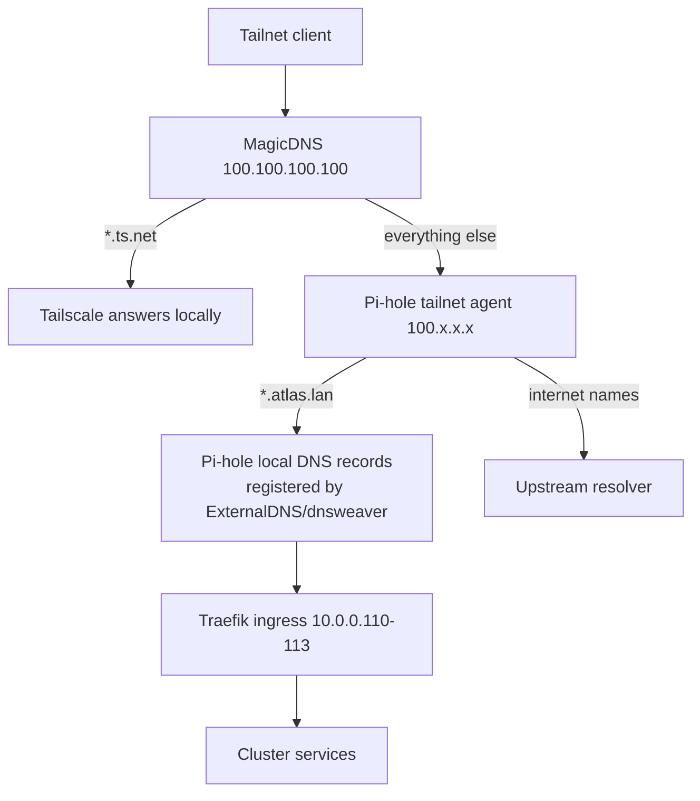

# ADR 0001 — Service naming and reachability for Atlas-hosted services

- **Status:** Accepted
- **Date:** 2026-10-03
- **Accepted:** 2026-10-04
- **Deciders:** 211 Lab
- **Related:** [C4 architecture](../c4-architecture.md), [GitOps platform](../gitops-platform.md), [Dedicated Pi-hole DNS](../pihole-dns.md)

## Context

Atlas is the 211 Lab k3s cluster. Services are exposed through Traefik Ingress
(node IPs `10.0.0.110-113`) and, per the [dedicated Pi-hole DNS design](../pihole-dns.md),
the Ingress hostname (`app.atlas.lan`) is auto-registered as an A record in a
dedicated Pi-hole. The stated goal is that "every device on the network can
discover services as they are deployed".

Until now the implicit assumption was that clients sit on the lab LAN
(`10.0.0.0/24`) and use that Pi-hole as their resolver. The access model is now
changing:

- **All clients will reach services over a Tailscale tailnet**, not necessarily
  from the lab LAN. A remote client resolves names through Tailscale MagicDNS
  (`100.100.100.100`), which only answers names in the tailnet domain
  (`*.ts.net`) and forwards everything else to its configured global
  nameservers.
- **Some hosts also serve clients outside the tailnet** (public internet), so
  they need names resolvable by third-party DNS, not just an internal resolver.
- **Pi-hole will be a Tailscale agent** on the tailnet and act as the network's
  DNS resolver.

Two name-discovery mechanisms are currently observable in the lab and are easy to
conflate:

| Mechanism | Example | Who answers | Scope | Config |
| --- | --- | --- | --- | --- |
| mDNS (RFC 6762) | `truenas.local` | the device itself (avahi / mDNS responder) | link-local L2 only | none — device-advertised |
| Unicast DNS | `truenas.atlas.lan` | the network resolver (Pi-hole) | whoever uses that resolver | A records in Pi-hole |

`.local` "just works" with no configuration because the device advertises it over
multicast; that is convenient, but it is link-local and outside anyone's control.
`.lan` is a normal DNS zone that the lab owns and serves.

The problem: choose one explicit naming/reachability strategy so cluster services
are reachable by the clients that need them, without surprises across mDNS, LAN
DNS, and the tailnet.

## Decision

> **Accepted 2026-10-04.** The naming/reachability strategy below is the
> canonical one for Atlas. The open questions (see *Follow-up items*) are
> implementation details that do not change the decision.

1. **`atlas.lan` is the canonical internal namespace for cluster services.**
   Every Ingress host is registered in Pi-hole as `*.<service>.atlas.lan` (or
   `*.atlas.lan`) and points at the Traefik ingress target.
2. **Pi-hole is a Tailscale agent and the tailnet's DNS resolver.** Set Pi-hole's
   tailnet IP (`100.x.x.x`) as a Tailscale **global nameserver with "Override
   local DNS" enabled**. Because Pi-hole is reachable at its tailnet IP, clients
   anywhere on the tailnet resolve `*.atlas.lan`, not just clients on the LAN.
3. **`*.ts.net` MagicDNS names are the stable, TLS-certifiable identity.** Use
   them for anything that needs a publicly trusted certificate (Tailscale's
   HTTPS certs only cover `*.ts.net`) and as the tailnet's native service
   discovery. `atlas.lan` records remain the friendly internal alias.
4. **Services that must reach non-tailnet clients use a real owned domain**
   (e.g. `svc.example.com`) via the same Traefik/reverse proxy, and are given a
   split-horizon override in Pi-hole so tailnet/LAN clients resolve them to the
   internal ingress address.
5. **Reject `.local` for service and infrastructure naming.** It is reserved for
   mDNS, is link-local (it does not traverse the tailnet), and no host controls
   its namespace.

### Resolution flow

## Consequences

- **Good:** one authoritative internal namespace (`atlas.lan`), independent of
  which network a client is on, as long as it is on the tailnet and uses
  Pi-hole; service discovery stays automatic via ExternalDNS/dnsweaver.
- **Good:** `*.ts.net` gives publicly trusted certs for tailnet-only services
  without running a private CA.
- **Bad / risk:** Pi-hole becomes a **single point of failure** for all
  non-`*.ts.net` resolution. A second Pi-hole (or anycast/HA pair) is required
  for anything approaching uptime expectations.
- **Bad / risk:** `*.atlas.lan` certificates cannot come from a public CA. They
  need an internal CA (e.g. cert-manager with a private issuer / step-ca), and
  clients must trust it.
- **Bad / risk:** clients that are **not** on the tailnet can never resolve
  `*.atlas.lan`; public services must use the real domain.
- **Neutral:** MagicDNS search-domain and "Override local DNS" behaviour must be
  documented, since it changes where client DNS queries go.

### Current status

The naming/reachability pieces are **live** (see
[Dedicated Pi-hole DNS](../pihole-dns.md)):

- The dedicated Pi-hole runs as an unprivileged LXC on `memex` (`10.0.0.10`,
  `pihole.atlas.lan`), provisioned by `ansible/playbooks/pihole.yaml` /
  `proxmox-create-pihole-lxc.yml`.
- `gitops/apps/external-dns.yaml` + `helm/values/external-dns.yaml` run
  ExternalDNS with the Pi-hole webhook provider; `gitops/sealed/pihole-api.yaml`
  is sealed with the real app password.
- `pihole.atlas.lan` resolves for in-cluster clients via CoreDNS
  (`coredns-custom`); ExternalDNS writes each Ingress host as an A record.
- Network cutover (router/DHCP pointing at `10.0.0.10`) is the remaining manual
  step; until then, LAN `.lan` resolution also relies on workstation
  `/etc/hosts` entries.

## Follow-up items (tracked; not blocking acceptance)

1. **How is the cluster ingress reachable over the tailnet?** Pi-hole can answer
   `*.atlas.lan`, but the A record points at Traefik node IPs (`10.0.0.110-113`)
   that are only on the lab LAN. Options:
   - run the **Tailscale Kubernetes operator / sidecar** so services get tailnet
     IPs directly;
   - run a **subnet router** advertising the lab LAN (or just the ingress
     subnet) into the tailnet;
   - keep Pi-hole records pointing at a **tailnet-reachable reverse proxy**.
2. **Naming surface:** flat `svc.atlas.lan`, or per-service wildcards
   (`*.svc.atlas.lan`)? How does this interact with ExternalDNS `domainFilters`?
3. **Certificate strategy** for `*.atlas.lan` (private CA choice, distribution of
   the trust anchor to clients).
4. **External-domain strategy:** which owned domain, and where does public DNS
   live (registrar/Cloudflare) relative to this repo.
5. **HA/SPOF:** is a second Pi-hole in scope now, or deferred?
6. **Search domains:** should `atlas.lan` be pushed to tailnet clients as a DNS
   search domain (so `ping truenas` works)?

## Alternatives considered

- **Use `.local` for everything (mDNS).** Rejected: link-local, does not cross
  the tailnet, no authoritative control, collision-prone.
- **Use only `*.ts.net` (no `atlas.lan`).** Viable and simple, but names are
  tied to Tailscale device identity rather than intent, and it does not help
  non-tailnet LAN devices or clients that must use a friendly internal name.
- **Use only a public subdomain (`*.home.example.com`).** Avoids the reserved-TLD
  question and gives public certs, but leaks internal topology to public DNS and
  requires split-horizon for internal addressing.
- **`.home.arpa` (RFC 8375).** IANA-reserved for home networks and arguably
  "more correct" than `.lan`, but longer, uglier, and `.lan` already works here
  with Pi-hole.
