# Application dependency views

Sources: [review D/K, 2026-10-07](../infrastructure-review.md#evidence-and-scope)
plus its [2026-10-11 refresh](../infrastructure-review.md#2026-10-11-sync-remediation-and-refresh).
Placement/version/health and every PVC are in the review. These focused views
show concrete components rather than hiding many applications in a grouping
box. Every diagram has at most five elements and no visible containers.

## Redop API and data

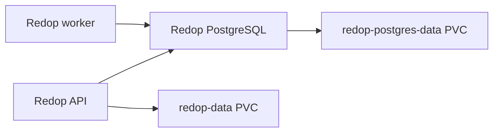

Both PVCs are NFS. The migration Job upgrades the shared DB before API
availability; its observed completion is not a backup. Worker uses the API
image but is a separate Deployment. Checkout image tags differ from live.

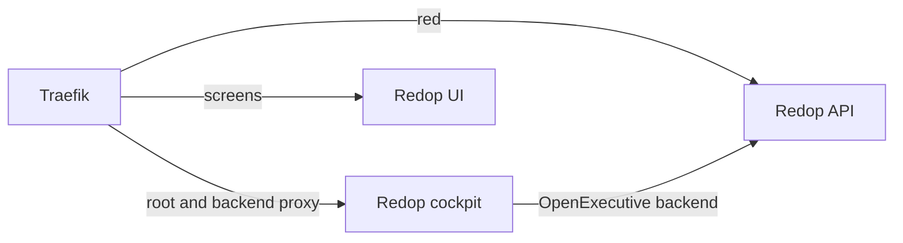

## Immich server dependencies

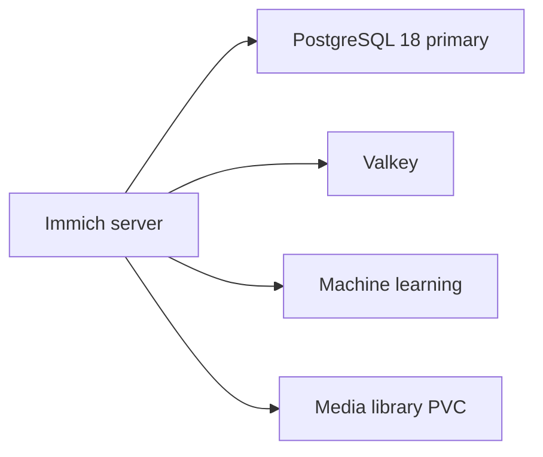

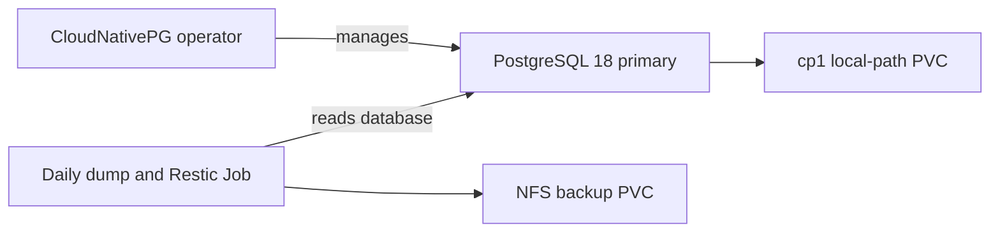

The second view separates ownership and backup from serving. A single primary
is not replicated HA. Media and backup share TrueNAS; DB dumps do not back up
media. ML's separate 10 GiB model-cache NFS claim is not the media library.
See [Immich recovery](../runbooks/immich.md).

## Smaller applications

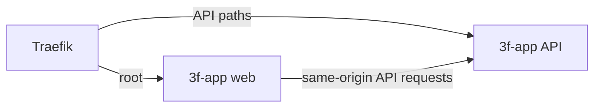

3f-app uses development-mode identity selection, not real authentication (D);
the IP middleware is a network restriction. No persistent claim was observed.

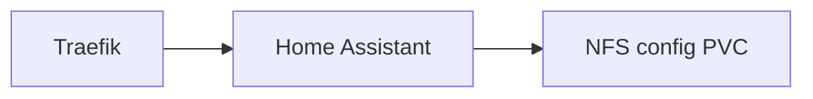

Home Assistant is single-replica and has an ingress NetworkPolicy plus IP
allowlist. Integrations/personal data and backup contents were not inspected.

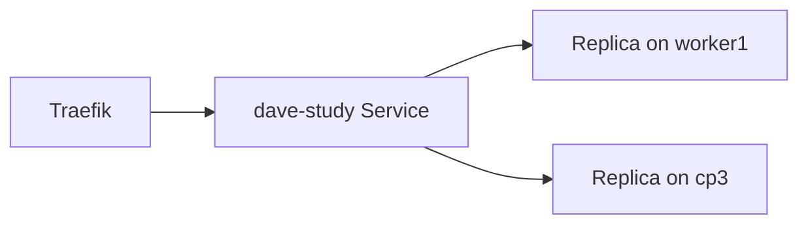

dave-study `v0.2.2` is stateless in the observed Kubernetes storage inventory.
The docs site has been live at `docs.atlas.lan` since 2026-10-11 (stateless,
immutable digest image); its delivery gates are in [Publishing](../docs-publishing.md).

## Newer apps (2026-10-08 to 2026-10-11)

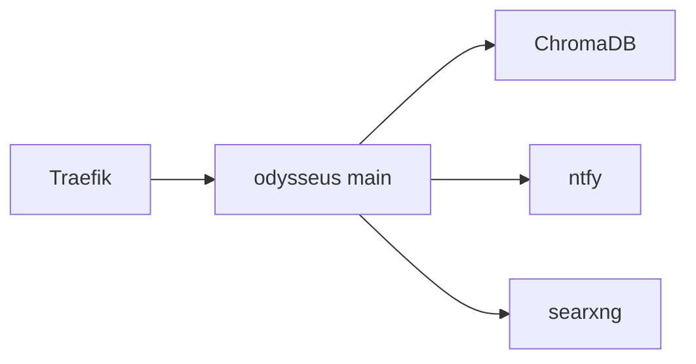

All four odysseus components are pinned to worker1 with four NFS claims
(`odysseus-data` 20Gi, `odysseus-chromadb` 10Gi, ntfy/searxng 1Gi each).

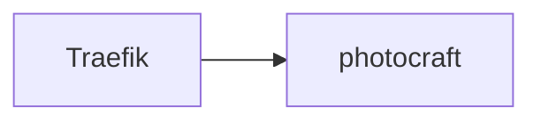

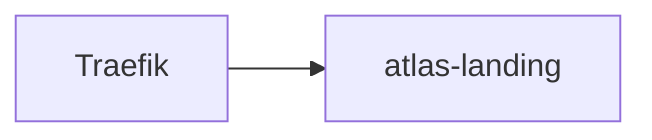

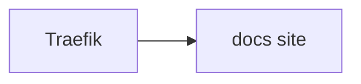

photocraft `v0.6.1` and atlas-landing `v0.2.0` are stateless single replicas;
docs is stateless too and runs an immutable digest image pulled with the
namespace-local `gitea-registry` SealedSecret, promoted by CI.
