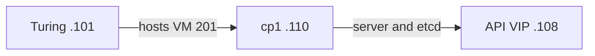
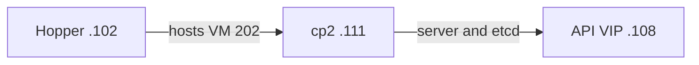
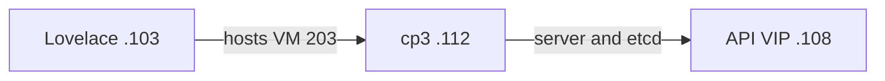
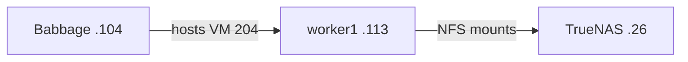
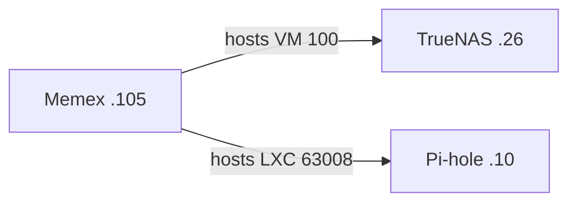
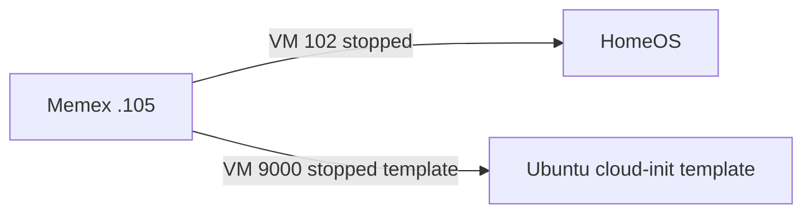
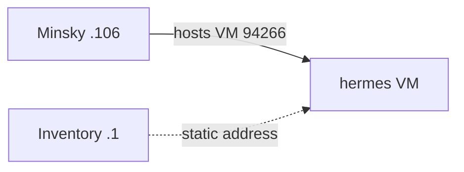
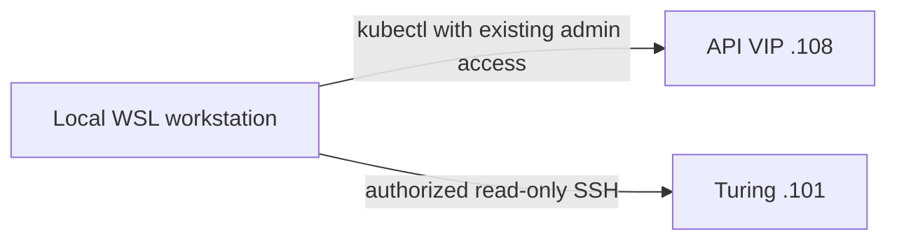

# Physical placement and failure domains

Source: [review evidence H/G/K/D](../infrastructure-review.md#evidence-and-scope).
Each diagram has three or four elements, no grouping containers. Arrows marked
"hosts" indicate placement, not network traffic. Four PVE members are quorate;
the two standalone hosts are not additional quorum voters.

## Control-plane placement

The repeated VIP is one shared API endpoint, not three different services.
Each control plane is 2 vCPU/4 GiB configured and also schedules application
pods. Keep at least two control planes online; PVE requires three of its four
votes independently. Live pod placement is in the review, not implied by the
VIP arrows.

## Worker and data

The worker is 2 vCPU/6 GiB configured; it carries CI and monitoring plus Immich
ML. It is not the exclusive application scheduling target. cp1/cp2/cp3 also
mount NFS. The single local Immich database is tied to cp1, not this worker.

## Standalone Memex

The repeated Memex is the same physical host. DNS and persistent storage share
its memory pressure and failure domain. The template is not a service. HomeOS
is separate from Kubernetes Home Assistant. Four disks pass through to TrueNAS;
RAID/pool health and recovery remain unavailable.

## Standalone Minsky and workstation

SSH to the other inventoried hosts used the same strict trust policy; the last
diagram is an access example, not a claim that only Turing is administered.
See the [complete host/guest tables](../infrastructure-review.md#hosts-and-failure-domains)
for capacity, guest versions, gaps and recovery evidence.
