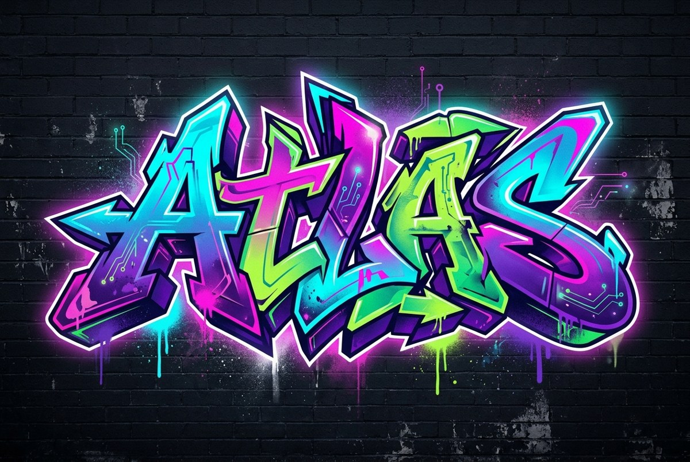
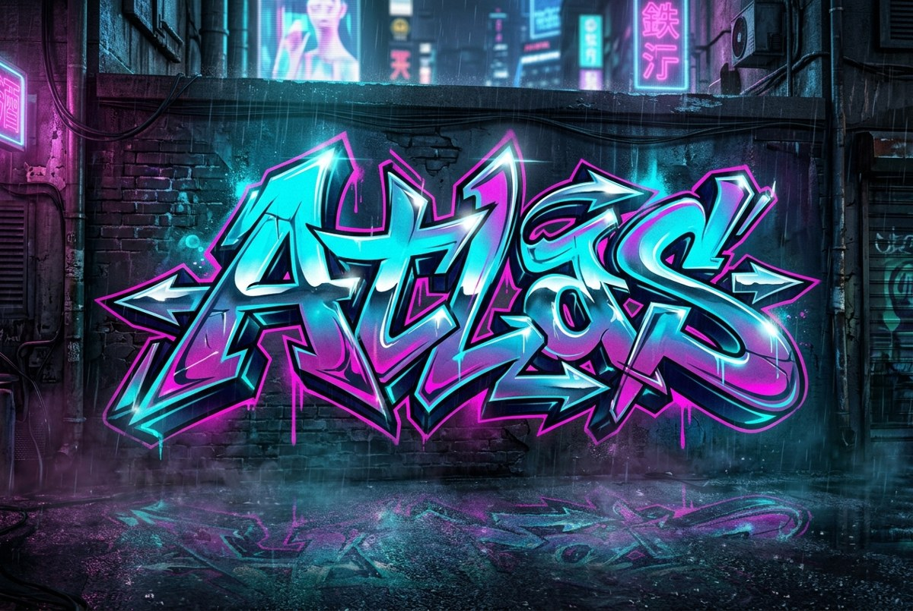
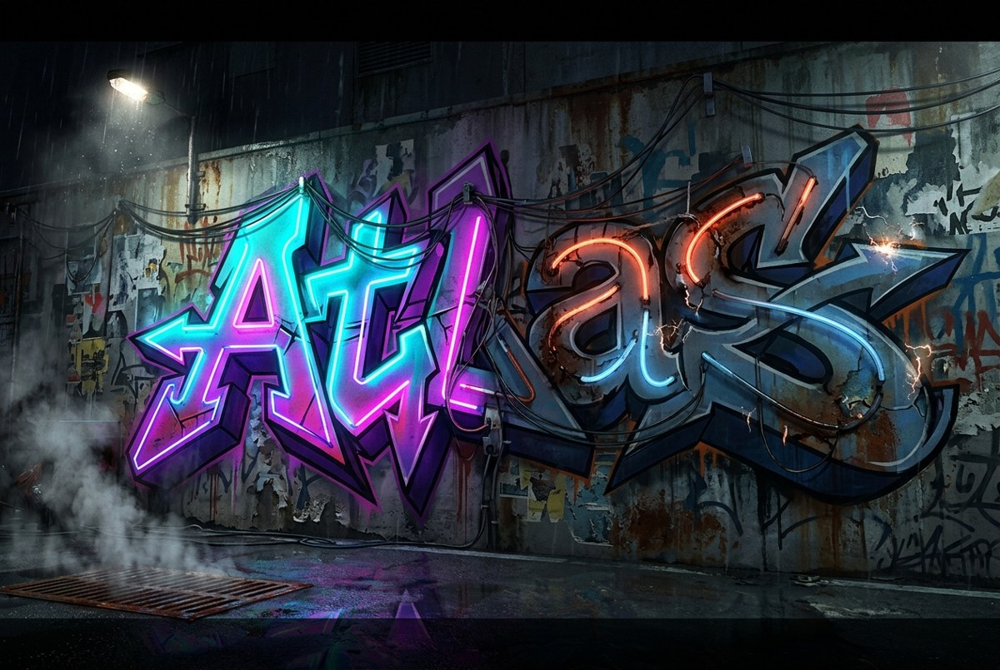
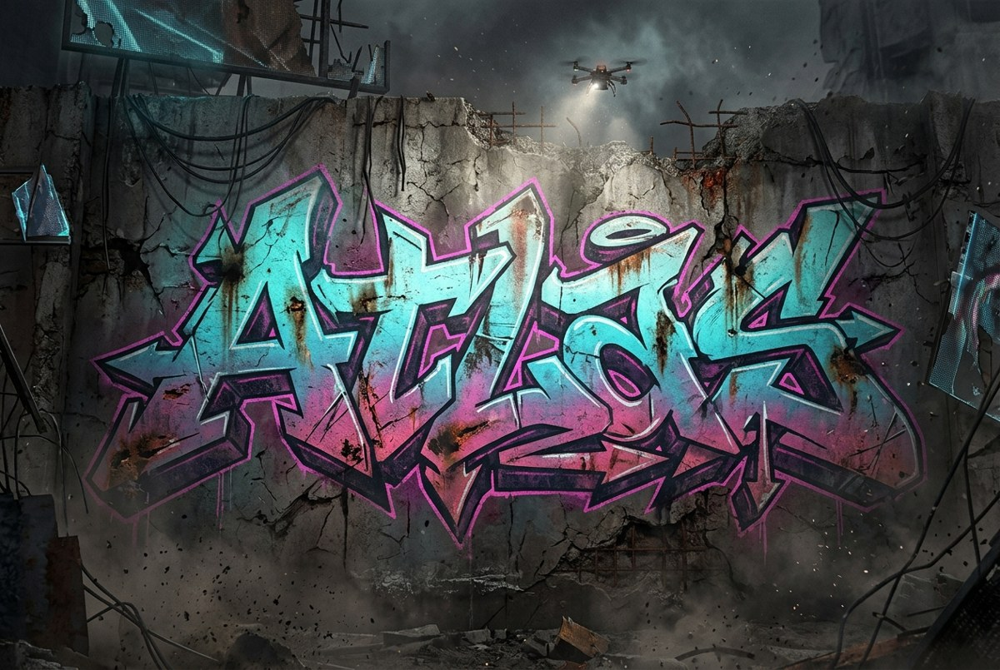
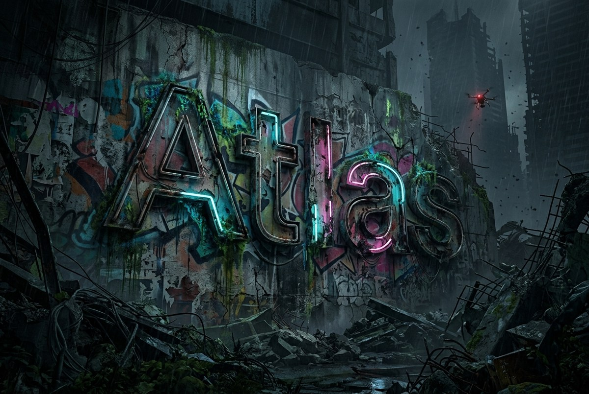
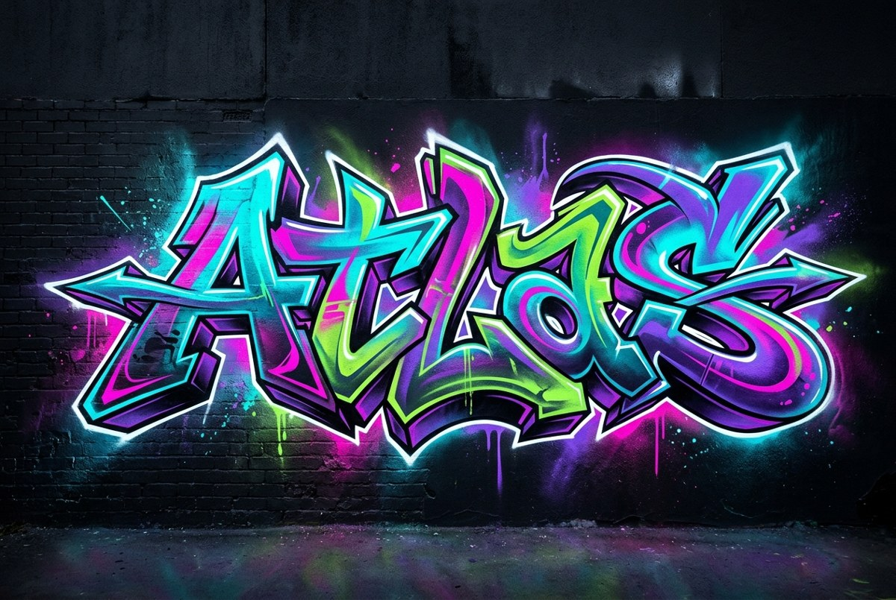
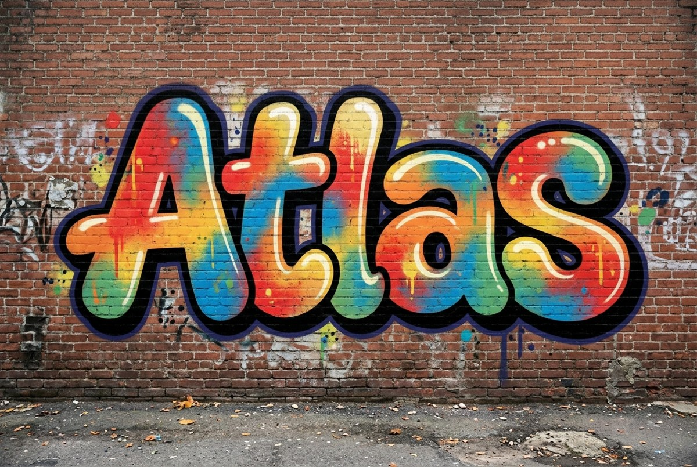
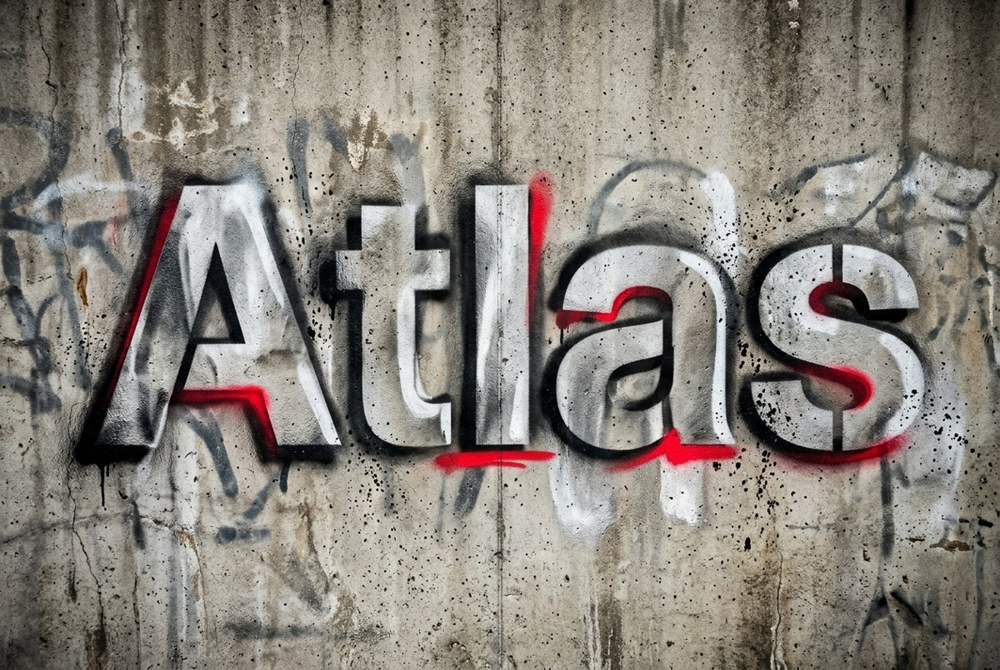

# Atlas landing art — review (temporary)

Temporary page to select the graffiti wordmark for the root `atlas.lan` landing
page (see the [software install backlog](backlog.md)). Three candidates were
generated with `google/gemini-nano-banana-2.1` via OpenRouter. Pick one; the
chosen direction will be refined into the hero, favicon, and Open Graph image,
and this page plus these assets will be removed.

All three spell **Atlas**. Candidates 2 and 3 read most cleanly; candidate 1's
wildstyle lettering is stylized and the middle letters are less legible.

## Wide-style series (new) — pick from these

Five wildstyle variations on a gradient from barely-technical to deeply
deteriorated post-apocalyptic cyberpunk neo-noir.

### W1 — Wildstyle + circuit hints (barely technical)

Clean neon/UV wall; the only future-tech is a couple of glowing circuit-trace
accents inside the letters.

### W2 — Rain-soaked neon back-alley (light cyberpunk)

Chrome-tinted wildstyle in a wet neon alley: holograms blurred behind, rain and
reflections, still a clean piece.

### W3 — Half-lit, flickering decay (balanced)

Half the piece glows healthy neon; the other half flickers or is burnt out.
Decaying mega-city wall: peeling posters, cables, steam, drizzle.

### W4 — Post-apocalyptic ruin (decay dominant)

Weathered, scratched, scorched neon fighting to stay lit on a ruined wall:
cracked concrete, rebar, dead billboard fragments, ash, one working drone light.

### W5 — Deeply deteriorated noir (city reclaims it)

Corroded, half-collapsed neon tubes and faded paint; mostly dead tubes with a few
dying embers of cyan and magenta. Collapsed wall, toxic rain, bioluminescent
mold creeping over the letters.

## Original three candidates (reference)

## 1 — Wildstyle, neon/UV on dark

## 2 — Blockbuster / throw-up on brick

## 3 — Stencil + spray, mono with red accent

