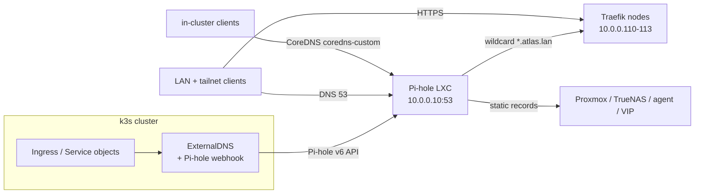

# DNS in the Atlas lab — Pi-hole resolver + automatic service discovery

This page documents the two halves of Atlas DNS:

1. **Pi-hole on the network** — the authoritative resolver every lab/tailnet
   device can use, with a wildcard for `*.atlas.lan` and static records for the
   non-Kubernetes hosts.
2. **Automatic service discovery** — ExternalDNS watching Kubernetes and writing
   each Ingress host into Pi-hole, so a newly deployed service is resolvable
   everywhere without touching DNS by hand.

Related: [Dedicated Pi-hole DNS](pihole-dns.md) (design),
[Pi-hole DNS runbook](pihole-runbook.md) (provision → wire → verify),
[Proxmox Pi-hole LXC](../ansible/docs/proxmox-pihole-lxc.md) (container).

## Architecture



## Part 1 — Pi-hole on the network

Pi-hole is an **unprivileged LXC on the `memex` Proxmox host** at
**`10.0.0.10`**, provisioned by Ansible (see
[Proxmox Pi-hole LXC](../ansible/docs/proxmox-pihole-lxc.md)). It is the single
authoritative resolver for `*.atlas.lan` and forwards everything else to
`1.1.1.1` / `8.8.8.8`.

### Wildcard for new services

Any `*.atlas.lan` name **without an explicit record** resolves to the four
Traefik ingress nodes, so nothing needs per-service DNS configuration:

```sh
dig +short @10.0.0.10 anything.atlas.lan
# 10.0.0.110  10.0.0.111  10.0.0.112  10.0.0.113
```

Implemented as dnsmasq lines in Pi-hole's `misc.dnsmasq_lines` (set by the
`pihole` role, default in
`ansible/playbooks/roles/pihole/defaults/main.yml`):

```
address=/atlas.lan/10.0.0.110
address=/atlas.lan/10.0.0.111
address=/atlas.lan/10.0.0.112
address=/atlas.lan/10.0.0.113
```

**Explicit records always win** over the wildcard (`dns.hosts` is consulted
before `address=/…`), so `pihole.atlas.lan` stays `10.0.0.10` and
`demo.atlas.lan` stays its ExternalDNS-managed `10.0.0.110`.

### Static records for non-Kubernetes hosts

The role also writes literal records into `dns.hosts` for the infrastructure
that is not a Kubernetes Service:

| Name | Address |
| --- | --- |
| `pihole.atlas.lan`, `dns.atlas.lan` | `10.0.0.10` |
| `router.lan`, `gw.lan` | `10.0.0.1` |
| `turing.atlas.lan` … `minsky.atlas.lan` | `10.0.0.101`–`10.0.0.106` |
| `api.atlas.lan` (kube-vip API VIP) | `10.0.0.108` |
| `homeos.atlas.lan` | `10.0.10.24` |
| `truenas.atlas.lan` | `10.0.10.26` |
| `agent.atlas.lan` | `10.0.10.155` |

Add or change these in `pihole_local_records` (role defaults or `-e`). The role
**merges** them into `dns.hosts` and never replaces ExternalDNS-owned entries.

### Pointing clients at Pi-hole

1. **Router / DHCP:** advertise `10.0.0.10` as the primary DNS server and reserve
   the address (so it is never leased to another device).
2. **Tailnet (optional):** add Pi-hole as a global nameserver with "Override
   local DNS" so tailnet clients get `*.atlas.lan` too.
3. Public resolvers stay configured on Pi-hole for non-lab names.

## Part 2 — ExternalDNS for `atlas.lan` hostnames

ExternalDNS runs in-cluster and keeps Pi-hole in sync with Kubernetes Ingress
(and Service) objects.

### How it works

```
Ingress created (host: app.atlas.lan)
        │
        ▼
ExternalDNS reads Ingress + the Traefik Service (node IPs 10.0.0.110-113)
        │  ApplyChanges
        ▼
Pi-hole v6 webhook (ghcr.io/tarantini-io/external-dns-pihole-webhook:v1.0.0)
        │  Pi-hole v6 API  →  dns.hosts
        ▼
Pi-hole answers app.atlas.lan → 10.0.0.110
```

A brand-new Ingress host becomes resolvable within the ExternalDNS interval
(1 minute) — no manual Pi-hole edit.

### Configuration

GitOps-managed:

- `gitops/apps/external-dns.yaml` — the Argo CD Application (chart
  `kubernetes-sigs/external-dns` `1.23.0`, provider `webhook`).
- `helm/values/external-dns.yaml` — values: webhook image, `PIHOLE_SERVER`,
  `domainFilters: [atlas.lan]`, `sources: [ingress, service]`,
  `registry: noop`, `policy: upsert-only`.
- `gitops/sealed/pihole-api.yaml` — the sealed Pi-hole app password the webhook
  authenticates with (re-seal with `kubeseal`; see the runbook).

`pihole.atlas.lan` must resolve **in-cluster** for the webhook to reach the API;
`gitops/manifests/coredns-atlas.yaml` (`coredns-custom`) carries the entry:

```
10.0.0.10   pihole.atlas.lan
```

### Registry/policy caveat (important)

The tarantini webhook (v1.0.0) handles **only A/AAAA/CNAME** and cannot store
external-dns TXT ownership records. The deployment therefore uses:

- `registry: noop` — never emit TXT records, and
- `policy: upsert-only` — create/update, **never prune**.

Consequence: deleting an Ingress leaves its A record in Pi-hole. Remove such
records manually (or move to a TXT-capable provider). The wildcard and static
records are safe from pruning.

### Adding a service's DNS

- **Ingress:** create an Ingress with `host: <name>.atlas.lan` — ExternalDNS
  records it automatically.
- **LoadBalancer/Service without an Ingress:** annotate it —
  `external-dns.alpha.kubernetes.io/hostname: <name>.atlas.lan` — and the
  Service source will publish it. (Today `atlas-monitoring-grafana` and
  `gitea-ssh-lb` are not annotated; the wildcard resolves their names to
  Traefik, but L7 routing needs an Ingress or IngressRoute.)

## Part 3 — Tailnet access

The tailnet already reaches the lab: **`memex` advertises `10.0.0.0/8` as an
approved subnet route** (its own tailnet address). Any tailnet device with
`--accept-routes` can therefore reach Pi-hole (`10.0.0.10:53`) and the Traefik
ingress nodes (`10.0.0.110-113`). **No Tailscale install is needed inside the
container.**

To make tailnet clients *use* Pi-hole, set it in the Tailscale admin console
(`login.tailscale.com` → **DNS**). Recommended — **split DNS**, so only
`atlas.lan` goes to Pi-hole:

1. **DNS → Nameservers → Add nameserver → Custom** → `10.0.0.10`.
2. Enable **Restrict to search domain** (split DNS) and enter `atlas.lan`.
3. (Optional) **DNS → Search domains** → add `atlas.lan` so `demo` resolves too.
4. Keep **MagicDNS** on.

If you instead want *all* tailnet DNS through Pi-hole, add `10.0.0.10` as a
global nameserver and enable **Override local DNS**. Pi-hole forwards non-lab
names upstream, so this is safe.

On each client, accept routes and DNS:

```sh
tailscale set --accept-routes --accept-dns=true
```

Verify from a tailnet device that is **not** on the lab LAN:

```sh
dig +short @10.0.0.10 demo.atlas.lan     # 10.0.0.110
dig +short demo.atlas.lan                # via Tailscale DNS
curl -ksS -o /dev/null -w '%{http_code}\n' https://demo.atlas.lan/   # 200
```

Automating it (optional): the same settings can be pushed with a Tailscale API
key (`POST /api/v2/tailnet/{tailnet}/dns/nameservers` and
`.../dns/split-dns`); use the tailnet name shown in your admin console.

Notes:

- `*.atlas.lan` answers point at `10.0.0.110-113`; they are reachable because of
  the `10.0.0.0/8` subnet route. If `memex` stops advertising it, tailnet clients
  lose both DNS and ingress reachability.
- `*.atlas.lan` certificates come from the internal `atlas-ca`; tailnet clients
  must trust it (or use `-k`).
- Alternative: run Tailscale inside the Pi-hole container to give it its own
  `100.x` address. Not required here, and it needs `/dev/net/tun` passthrough in
  the unprivileged LXC.

## Verify

```sh
# network resolver + wildcard
dig +short @10.0.0.10 pihole.atlas.lan        # 10.0.0.10
dig +short @10.0.0.10 newservice.atlas.lan    # 10.0.0.110-113
dig +short @10.0.0.10 memex.atlas.lan         # 10.0.0.105

# ExternalDNS-managed Ingress host
dig +short @10.0.0.10 demo.atlas.lan          # 10.0.0.110

# ExternalDNS health
kubectl -n argocd get application external-dns      # Synced / Healthy
kubectl -n external-dns logs deploy/external-dns -c webhook --tail=20
```

Success = names resolve from Pi-hole and the endpoint answers over HTTPS:
`curl -ksS --resolve demo.atlas.lan:443:10.0.0.110 https://demo.atlas.lan/`
→ `200`.

## Troubleshooting

| Symptom | Check / fix |
| --- | --- |
| Ingress host does not resolve | ExternalDNS pod healthy; `kubectl -n external-dns logs … -c external-dns`; confirm namespace/domain in `domainFilters`. |
| ExternalDNS `Degraded` | `pihole-api` secret missing/placeholder, or `pihole.atlas.lan` unresolved in-cluster. Re-seal and check `coredns-custom`. |
| A deleted Ingress record lingers | Expected with `policy: upsert-only`; delete it in Pi-hole → Settings → Local DNS Records. |
| Static record disappeared after a role run | Should not happen — the role merges; verify `pihole_local_records`. |
| Wildcard returns nothing | `pihole-FTL --config misc.dnsmasq_lines` should list the four `address=/atlas.lan/…` lines; re-run the role. |

## References

- [Pi-hole v6](https://docs.pi-hole.net/)
- [ExternalDNS](https://github.com/kubernetes-sigs/external-dns) ·
  [Pi-hole webhook provider](https://github.com/tarantini-io/external-dns-pihole-webhook)
- [ADR 0001 — Service naming and reachability](adr/0001-service-naming-and-reachability.md)
