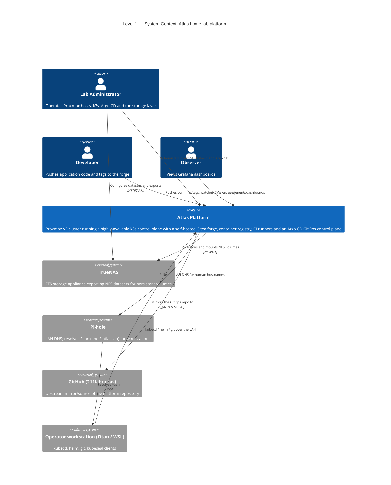
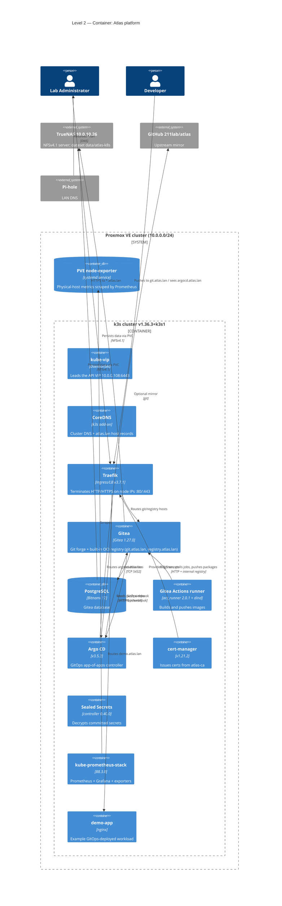
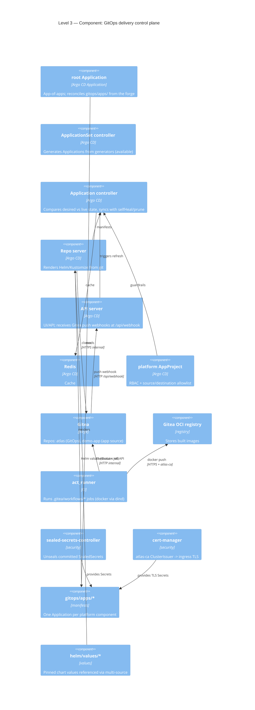
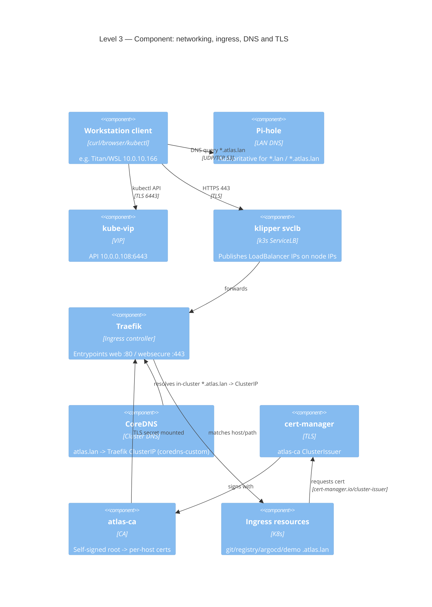
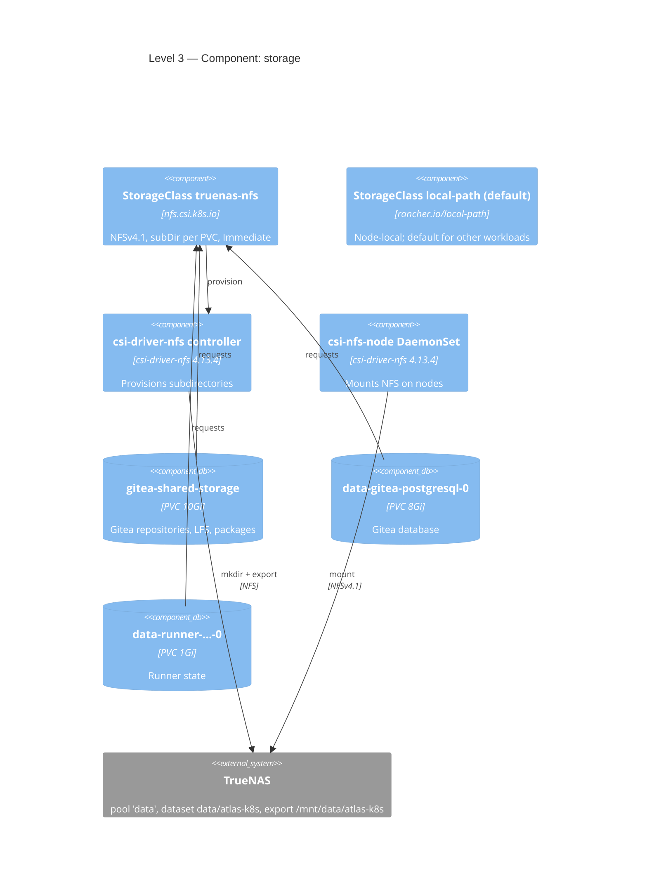
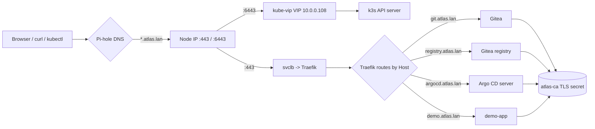
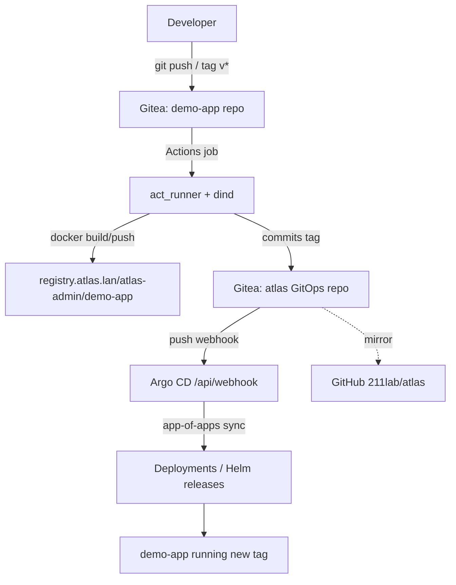
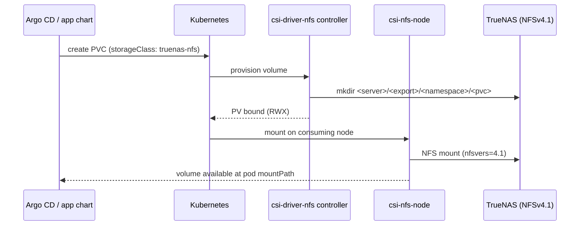

# Atlas infrastructure — C4 architecture

> Scope: a complete, current view of the Atlas home lab using the
> [C4 model](https://c4model.com/) (Context → Container → Component →
> Deployment), with supporting views for compute, storage, networking, TLS, and
> the delivery pipeline. Diagrams are Mermaid and render on GitHub.
>
> Verified 2026-10-02. Companion runbooks:
> [Kubernetes control plane](kubernetes-control-plane.md) and
> [GitOps platform](gitops-platform.md).

## How to read this document

| Level | Question it answers | Diagram |
| --- | --- | --- |
| 1 – System Context | Who uses Atlas and what external systems does it depend on? | [`C4Context`](#level-1--system-context) |
| 2 – Container | What are the deployable/running units and how do they talk? | [`C4Container`](#level-2--container) |
| 3 – Component | What is inside the delivery control plane? | [`C4Component`](#level-3--component-delivery-control-plane) |
| 3 – Component | What is inside the network/ingress/TLS layer? | [`C4Component`](#level-3--component-networking-ingress-dns-and-tls) |
| 3 – Component | What is inside the storage layer? | [`C4Component`](#level-3--component-storage) |
| Deployment | Which physical host / VM runs what? | [`C4Deployment`](#deployment-view) |

Supporting views cover [compute](#compute-view), the
[CI/CD and promotion flow](#delivery-flow), the
[request/DNS/TLS flow](#request-flow), and
[storage provisioning](#storage-provisioning).

## Level 1 — System Context

Atlas is a self-hosted Kubernetes platform. Operators and developers interact
with it; it depends on TrueNAS for persistent storage, Pi-hole for internal DNS,
and mirrors its source of truth to GitHub.



## Level 2 — Container

The platform is a Proxmox VE cluster whose four core hosts run k3s VMs; k3s runs
the platform containers (Traefik ingress, Gitea + registry, CI runner, Argo CD,
cert-manager, Sealed Secrets, monitoring). TrueNAS provides NFS-backed PVCs.



## Level 3 — Component: delivery control plane

Inside the GitOps/delivery control plane: Argo CD's components, the forge, the
CI runner, and the security primitives.



## Level 3 — Component: networking, ingress, DNS and TLS

How a request from a workstation reaches a workload, and how names resolve and
certs are issued.



## Level 3 — Component: storage

Persistent volumes come from TrueNAS over NFS via the `nfs.csi.k8s.io` driver;
`local-path` remains the cluster default for non-platform workloads.



## Deployment view

Physical and logical placement: Proxmox hosts → k3s VMs → pods, plus TrueNAS.

```mermaid
C4Deployment
    title Deployment — physical and logical placement

    Deployment_Node(pve, "Proxmox VE cluster", "6 bare-metal hosts, 10.0.0.101-106") {
        Deployment_Node(turing, "Turing 10.0.0.101", "PVE host") {
            Deployment_Node(cp1, "atlas-k3s-cp1 / VM 201", "Ubuntu 24.04, 2 vCPU, 3.8 GiB, 10.0.0.110") {
                Container(k3s1, "k3s server + etcd + kube-vip", "control plane")
            }
        }
        Deployment_Node(hopper, "Hopper 10.0.0.102", "PVE host") {
            Deployment_Node(cp2, "atlas-k3s-cp2 / VM 202", "Ubuntu 24.04, 2 vCPU, 3.8 GiB, 10.0.0.111") {
                Container(k3s2, "k3s server + etcd + kube-vip", "control plane")
            }
        }
        Deployment_Node(lovelace, "Lovelace 10.0.0.103", "PVE host") {
            Deployment_Node(cp3, "atlas-k3s-cp3 / VM 203", "Ubuntu 24.04, 2 vCPU, 3.8 GiB, 10.0.0.112") {
                Container(k3s3, "k3s server + etcd + kube-vip", "control plane")
            }
        }
        Deployment_Node(babbage, "Babbage 10.0.0.104", "PVE host") {
            Deployment_Node(wk, "atlas-k3s-worker1 / VM 204", "Ubuntu 24.04, 2 vCPU, 5.7 GiB, 10.0.0.113") {
                Container(pods, "Platform + app pods", "Gitea, Argo CD, runner, monitoring, demo-app")
            }
        }
        Deployment_Node(extra, "Memex 10.0.0.105 / Minsky 10.0.0.106", "Additional PVE/Ubuntu hosts", "Non-k3s lab services")
    }

    Deployment_Node(tn, "TrueNAS (10.0.10.26)", "Storage appliance") {
        Deployment_Node(pool, "ZFS pool 'data'", "datasets: atlas-k8s, movies, pictures, series") {
            ContainerDb(export, "NFS export", "/mnt/data/atlas-k8s")
        }
    }

    Deployment_Node(ws, "Operator workstation", "Titan / WSL 10.0.10.166") {
        Container(cli, "kubectl / helm / git / kubeseal", "admin tooling")
    }

    Rel(cli, k3s1, "kubectl via VIP 10.0.0.108:6443")
    Rel(pods, export, "NFSv4.1 PVCs")
    Rel(k3s1, k3s2, "etcd peer")
    Rel(k3s2, k3s3, "etcd peer")
```

## Compute view

| Layer | Name | Address | Role | Capacity |
| --- | --- | --- | --- | --- |
| PVE host | Turing | 10.0.0.101 | Proxmox; hosts VM 201 | — |
| PVE host | Hopper | 10.0.0.102 | Proxmox; hosts VM 202 | — |
| PVE host | Lovelace | 10.0.0.103 | Proxmox; hosts VM 203 | — |
| PVE host | Babbage | 10.0.0.104 | Proxmox; hosts VM 204 | — |
| PVE host | Memex | 10.0.0.105 | Additional host (standalone) | — |
| PVE host | Minsky | 10.0.0.106 | Additional Ubuntu host | — |
| k3s node | atlas-k3s-cp1 | 10.0.0.110 (VM 201) | control-plane, embedded etcd | 2 vCPU / 3.8 GiB |
| k3s node | atlas-k3s-cp2 | 10.0.0.111 (VM 202) | control-plane, embedded etcd | 2 vCPU / 3.8 GiB |
| k3s node | atlas-k3s-cp3 | 10.0.0.112 (VM 203) | control-plane, embedded etcd | 2 vCPU / 3.8 GiB |
| k3s node | atlas-k3s-worker1 | 10.0.0.113 (VM 204) | worker | 2 vCPU / 5.7 GiB |
| API VIP | kube-vip | 10.0.0.108:6443 | HA Kubernetes API | — |

Totals: **8 vCPU / ~17.7 GiB** across the k3s layer; typical steady-state use
~25–35 % memory. Because only one node is a worker, platform stateful workloads
are scheduled there unless they use NFS (which is node-independent).

## Request flow



## Delivery flow



## Storage provisioning



## Trust and security boundaries

- **Layer separation**: Proxmox root ≠ guest `control`/`ubuntu` ≠ Kubernetes
  admin kubeconfig ≠ Argo CD RBAC. A credential for one layer does not grant the
  next.
- **TLS**: a single internal CA (`atlas-ca`) signs all `*.atlas.lan` certs.
  Workstations and k3s nodes trust it explicitly; public trust is not assumed.
- **Secrets**: never committed in plaintext. Sealed Secrets encrypt them at rest
  in git; the controller's private key is the only in-cluster decryption key.
- **Registry/CI**: the runner pushes to the private registry over TLS validated
  by `atlas-ca`; workloads pull with a per-namespace image pull secret.
- **Webhook path**: Gitea must be explicitly allowed to call the in-cluster Argo
  CD service (`GITEA__security__ALLOWED_HOST_LIST`), and the payload is
  HMAC-verified with the shared secret in `argocd-webhook`.

## Inventory quick reference

| Concern | Value |
| --- | --- |
| Kubernetes | k3s v1.36.3+k3s1, 3× control-plane/etcd + 1 worker |
| API endpoint | https://10.0.0.108:6443 (kube-vip) |
| Ingress hosts | `git.atlas.lan`, `registry.atlas.lan`, `argocd.atlas.lan`, `demo.atlas.lan` |
| DNS | Pi-hole (LAN) + CoreDNS `coredns-custom` (in-cluster) |
| TLS CA | `atlas-ca` ClusterIssuer (cert-manager v1.21.2) |
| Forge/registry | Gitea 1.27.0, PostgreSQL 17, built-in OCI registry |
| Git over SSH | `ssh://git@git.atlas.lan:2222/<owner>/<repo>.git` (`gitea-ssh-lb`, ServiceLB) |
| CI | Gitea Actions (act_runner 2.0.1) with dind, `docker:25-git` job image |
| CD | Argo CD v3.5.3 (app-of-apps), Gitea push webhook, 60s git poll fallback |
| Storage | TrueNAS NFS (`truenas-nfs`) for platform data; `local-path` default |
| Observability | kube-prometheus-stack 88.3.0 (Prometheus, Grafana, exporters) |
| Secrets | Sealed Secrets controller 0.40.0 |
| Upstream mirror | github.com/211lab/atlas |

## Gaps and future work

- **Single worker node**: only `atlas-k3s-worker1` schedules general workloads;
  adding a second worker would improve resilience and capacity.
- **Prometheus storage** is ephemeral (no PVC); wire it to `truenas-nfs` for
  retention.
- **`gitea-actions` Application** reports `OutOfSync` (Helm-generated field
  noise); it is healthy and functional.
- **Titan Windows exporter** is not yet installed (physical-host Windows
  metrics).
- **TrueNAS `movies` export** is intentionally left untouched and is unrelated
  to Kubernetes storage.
