# Atlas infrastructure — architecture

This retains the C4 questions (context, deployable units, components and
deployment) using supported Mermaid flowcharts/sequence diagrams. Every view
has at most five elements, counting participants and visible containers.
Repeated nodes across views refer to the same component. No grouping boxes
hide additional entities.

Sources: [infrastructure review D/H/G/K/N](infrastructure-review.md#evidence-and-scope).
Declared relationships are not proof of successful live traffic. The older
snapshot is superseded by the review's explicit live evidence and gaps.
Companion runbooks: [control plane](kubernetes-control-plane.md),
[GitOps](gitops-platform.md), [DNS](atlas-dns.md),
[applications](applications.md).

## How to read this document

| Question | Focused views |
| --- | --- |
| Who uses Atlas? | [System context](#level-1--system-context) |
| What runs and talks? | [Containers](#level-2--container) and [app dependencies](architecture/application-dependencies.md) |
| What controls delivery? | [Delivery components](#level-3--component-delivery-control-plane) |
| How do requests resolve and get TLS? | [Networking](#level-3--component-networking-ingress-dns-and-tls) and [requests](#request-flow) |
| Where does data persist? | [Storage](#level-3--component-storage) and [provisioning](#storage-provisioning) |
| Which host runs each guest? | [Deployment](#deployment-view), [placement](architecture/placement.md) and review inventory |

## Level 1 — System Context

Atlas is a self-hosted Kubernetes platform for operators, developers and
observers. Administrative access crosses separate host, guest and Kubernetes
trust boundaries; application usage does not grant administrative credentials.

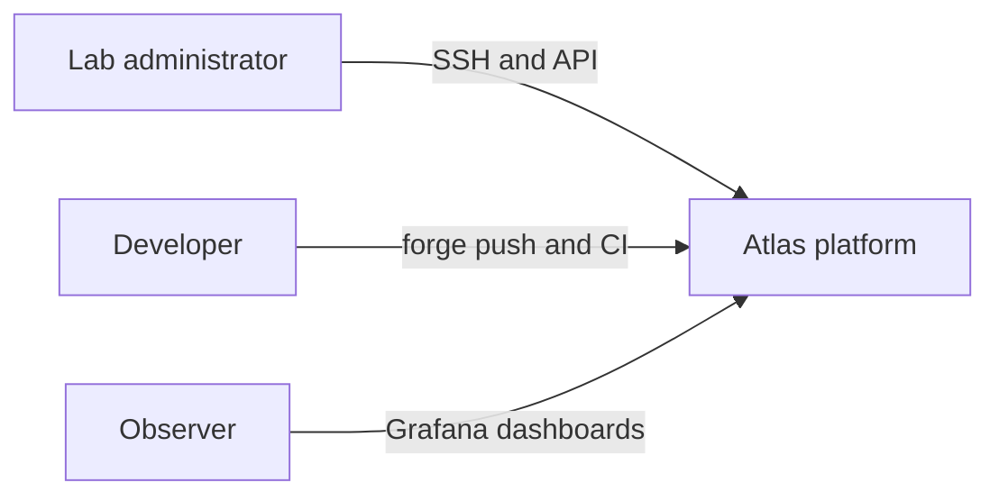

Storage and naming are external dependencies, not additional quorum nodes.
Pi-hole is an LXC on Memex; TrueNAS is a VM on the same host. GitHub is the
declared upstream mirror, not the live Argo source of truth.

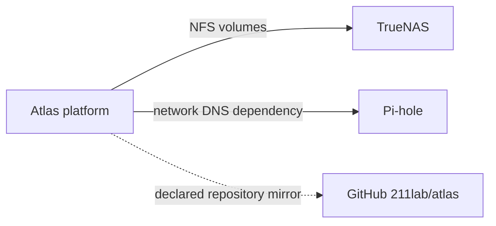

## Level 2 — Container

The core four-host PVE cluster runs three k3s servers and one agent. Memex and
Minsky are standalone PVE hosts; there is no six-host Corosync cluster.
Platform containers include ingress, DNS, forge/registry/CI, Argo, certificate
and secret controllers, monitoring and CNPG. The review enumerates all 17
namespaces, including non-platform applications and empty system/legacy ones.

### Forge and build units

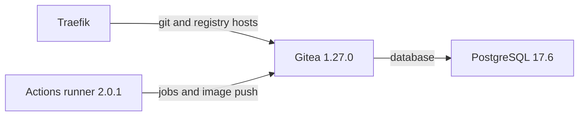

Gitea includes the OCI registry; it is not a separate registry Deployment.
Runner uses Docker-in-Docker `29.5.2`; CI job images such as `docker:25-git`
are workflow declarations, not the runner version. Forge data, database and
runner state have separate NFS PVCs (10/8/1 GiB). Gitea's declared `Recreate`
strategy avoids simultaneous writers and LevelDB lock conflicts.

### Monitoring units

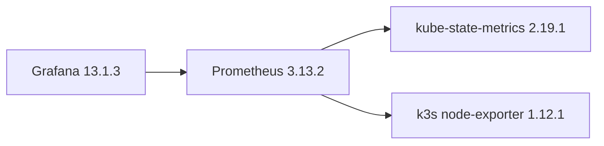

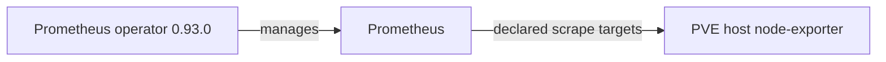

PVE exporter services were active on the four cluster hosts, inactive on Memex
and Minsky. Scrape success/alerts were not verified. kube-prometheus-stack
88.3.0 is a k3s HelmChart, not an Argo child. Grafana's sidecars load declared
dashboards/datasources; both Grafana and Prometheus storage are ephemeral.

## Level 3 — Component: delivery control plane

### Desired-state rendering

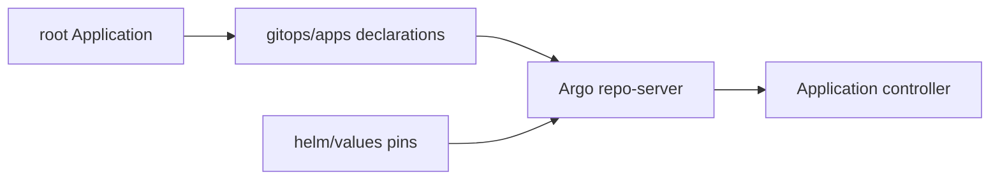

root reconciles child Application declarations. Repo-server clones the forge
repository and renders Helm/directory sources; upstream chart versions are
pinned, and `$values` references Git. In-house charts are under `apps/`.
Controller compares and reconciles desired/live resources with the declared
automated prune/self-heal policy. ApplicationSet controller is available but
its presence does not prove that any Applications are generated by it.

### Refresh, cache and policy

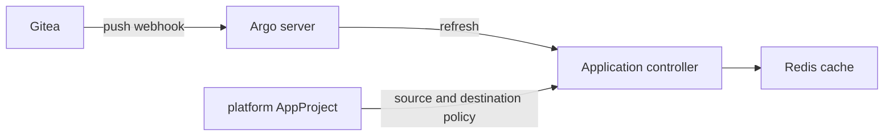

Argo `v3.5.3` has server/UI/API, repo-server, application controller,
ApplicationSet controller and Redis `8.6.4-alpine`. The declared Gogs webhook
uses `/api/webhook`, HMAC verification and Gitea's outbound private-host
allowlist; Git polling is the declared 60s fallback. This review did not send
webhooks or inspect their shared secret. Policy/RBAC effectiveness was not
audited beyond observed Application project membership.

### Secret and certificate controllers

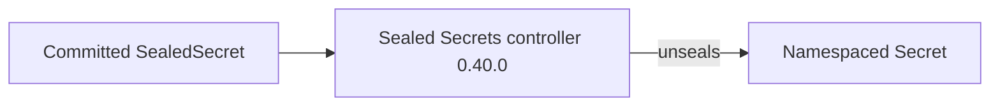

Sealed Secrets protects committed ciphertext; the controller's decryption key
needs an independently verified backup. It is not by itself proof of etcd
encryption at rest. Certificate issuance is a separate trust path below.

## Level 3 — Component: networking, ingress, DNS and TLS

### LAN discovery

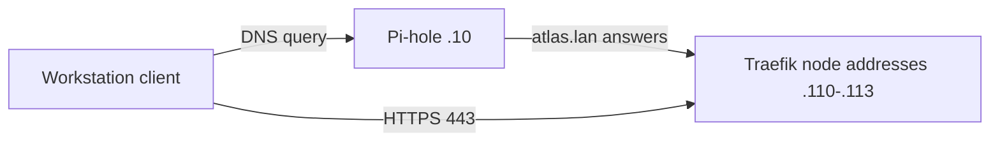

DNS returns destination addresses; Pi-hole does not proxy HTTP. The live docs
name resolved but had no live route. See [DNS architecture](atlas-dns.md) for
wildcards, static records, ExternalDNS upsert-only semantics and unverified
DHCP/tailnet adoption. `.local` mDNS is not the chosen service namespace.

### In-cluster discovery

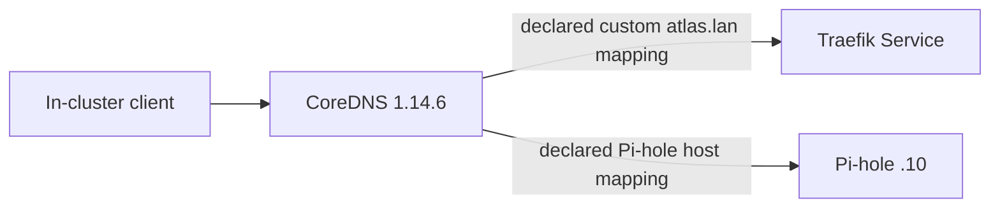

CoreDNS custom routing is declared in git; the review did not independently
query live ConfigMap contents or execute a lookup inside a pod. It is distinct
from the network-wide Pi-hole resolver path.

### TLS issuance

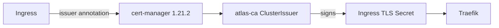

`atlas-selfsigned-bootstrap` initializes the root CA Certificate; `atlas-ca`
signs leaf certificates using the `atlas-ca-tls` Secret in cert-manager.
Issuer and Certificate Ready status was observed, not private-key contents.
`atlas-ca` ConfigMaps described by runbooks distribute the public trust anchor;
they are not SealedSecrets and do not contain the private signing key. Node
registry CA trust and per-namespace image-pull credentials remain separate
dependencies. Internal TLS is not public PKI or user authentication.

## Level 3 — Component: storage

### NFS consumers

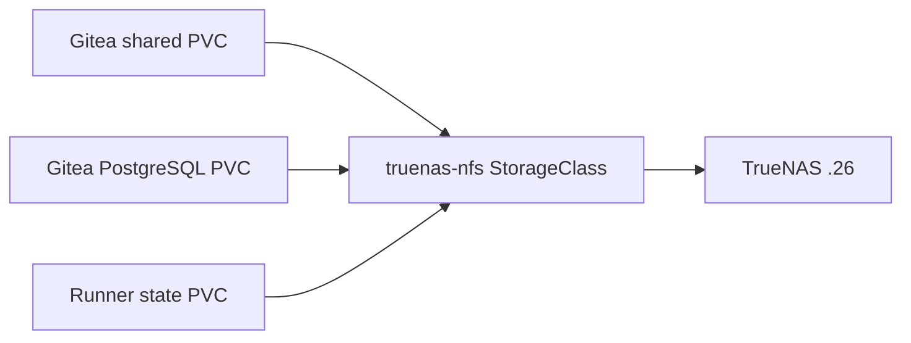

The view shows forge consumers only. [Application dependency views](architecture/application-dependencies.md)
cover Redop, Home Assistant and Immich instead of putting their individual
claims into a large box. The review lists every PVC, size, access mode and
placement. NFS server capacity and pool health were inaccessible.

### NFS machinery

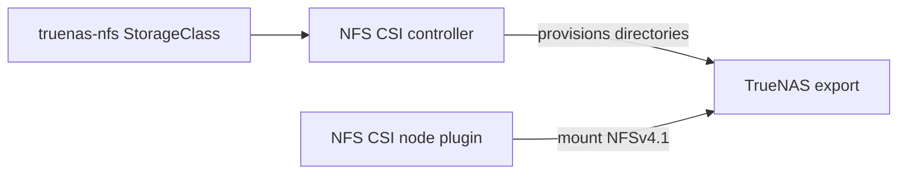

NFS CSI `4.13.4` uses export `/mnt/data/atlas-k8s` and a per-namespace/PVC
subdirectory. Class permits expansion and binds Immediately. Driver provisions
directories under an existing export; it does not create the TrueNAS appliance,
ZFS pool or export. Historical export settings (`mapall root`, permitted lab
networks, security SYS) were not independently re-audited.

### Local database exception

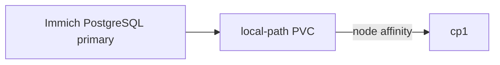

`local-path` is default, WaitForFirstConsumer, node-local. Immich DB is an
explicit exception to NFS-backed platform persistence; recovery depends on
off-node dumps. Both classes and all observed PVs have Delete reclaim policy.
PVC class is immutable; recreation is destructive, not an authorized review
action. Bound storage does not prove backup durability.

## Deployment view

The [physical placement page](architecture/placement.md) splits all six hosts
and every guest into focused views. Turing/Hopper/Lovelace host VMs 201–203;
Babbage hosts VM 204; Memex hosts TrueNAS, Pi-hole, stopped HomeOS and a
template; Minsky hosts hermes. The four core PVE hosts have one k3s VM each.
There is no claim of VM HA migration: observed HA-resource lists on Turing and
Memex were empty.

## Compute view

| Layer | Name / address | Role / configured capacity |
| --- | --- | --- |
| PVE cluster | Turing `.101`, Hopper `.102`, Lovelace `.103`, Babbage `.104` | Four quorum voters; 4 CPUs/~15.5 GiB usable each |
| Standalone PVE | Memex `.105`, Minsky `.106` | NAS/DNS versus hermes; separate failure domains, not cluster members |
| k3s server | cp1/2/3 `.110/.111/.112` | Each 2 vCPU/8 GiB configured (resized from 4 GiB on 2026-10-10 after cp1 memory exhaustion), ~7.8 GiB API capacity; embedded etcd |
| k3s agent | worker1 `.113` | 2 vCPU/8 GiB configured (resized from 6 GiB on 2026-10-10), ~7.7 GiB API capacity |
| API VIP | `.108:6443` | kube-vip, not an additional server |

No node is tainted: control planes carry most application pods. NFS removes
node affinity for those volumes, not application single-writer constraints.
At collection control-plane memory was ~68–69%, worker ~41%; worker root was
84% used. Do not use the historical 25–35% estimate for capacity planning.

## Request flow

### Kubernetes API

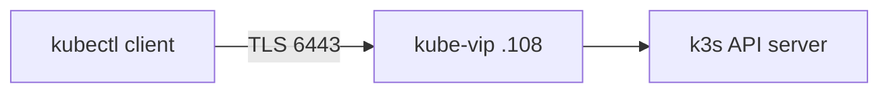

### Application HTTPS

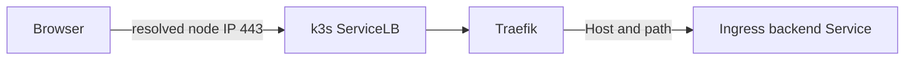

ServiceLB publishes Traefik on every node IP; one observed Traefik pod runs on
cp1. Concrete backend hosts, ports, TLS certs and Redop/3f-app path splits are
listed in the [review](infrastructure-review.md#ingress-dns-and-trust).
Gitea SSH 2222 and Grafana HTTP 3000 are separate LoadBalancer paths, not HTTPS
Ingress routes.

## Delivery flow

### Build and promotion

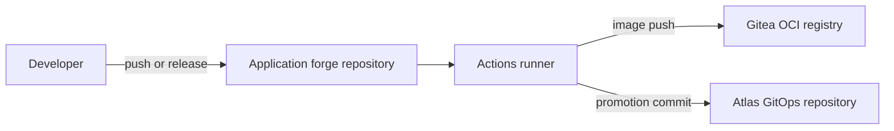

### Reconciliation

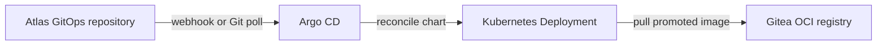

Argo core does not poll registry tags; CI writes the immutable image reference
into Git. Workload and workflow details differ by application. The docs
publishing pipeline is a separate, uncommitted declaration with authorization
and credential gates, not a completed release. GitHub remains a declared mirror
outside this live reconciliation path.

## Storage provisioning

The bounded five-participant sequence describes the declared provisioning
protocol, not a mutation performed by this review.

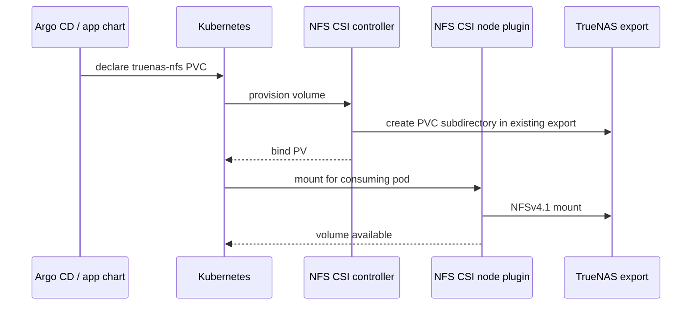

## Trust and security boundaries

- Proxmox root, guest `control`/`ubuntu`, Kubernetes cluster-admin and Argo RBAC
  are separate administrative layers. Existing authorized SSH was used without
  relaxing host-key trust; Secret values were not inspected.
- `atlas-ca` is a private trust root. Client trust must be distributed and
  independently checked; the review's docs `curl -k` status probe does not
  verify TLS trust.
- Sealed Secrets encryption in Git depends on controller key recovery. CA key
  recovery and etcd encryption are distinct concerns.
- CI dind and platform hostPath/network agents are high-trust boundaries;
  namespace-local registry pull credentials do not grant forge administration.
- Only selected namespaces have NetworkPolicies; observed policies and IP
  allowlists are not proof of tenant isolation or identity enforcement.

## Inventory quick reference

The authoritative dated [review](infrastructure-review.md) includes all hosts,
guests, namespaces, live/declared Apps, platform HelmCharts, ingress and PVCs.
Git-over-SSH is `ssh://git@git.atlas.lan:2222/<owner>/<repo>.git`.
Monitoring Grafana is HTTP node port 3000; DNS uses Pi-hole `.10`, not the old
unprovisioned `.107` proposal. TrueNAS `.26` is the NFS storage dependency;
its version and pool health were inaccessible.

## Gaps and future work

There is one worker, several single-replica services, ephemeral monitoring,
Memex memory/swap pressure, worker disk pressure and persistent runner drift.
Immich's scheduled backup Job completed but restore/off-site/media protection
remain unproven. Agent guest SSH and NAS authentication are access gaps.
Windows-host exporter installation and tailnet/DHCP cutover are historical or
unverified claims, not live success. The existing NAS movies export is outside
the Kubernetes design and was not inspected or changed. See review findings
before planning separately authorized remediation.
