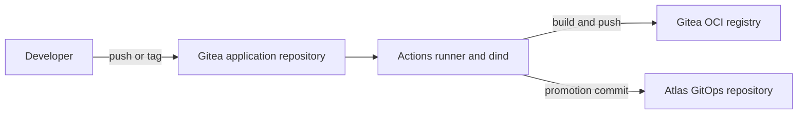
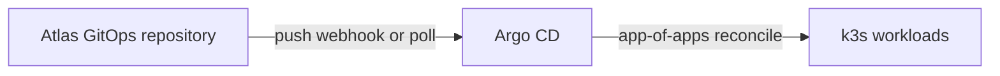

# Atlas GitOps platform runbook

> See [C4 architecture](c4-architecture.md) for the full system/container/component/deployment views.

> Scope: a self-contained git forge (Gitea) and continuous delivery control
> plane (Argo CD) running on the Atlas k3s cluster, plus a build runner and an
> automated image-promotion loop. All configuration is Helm-driven and stored in
> this repository as the source of truth.

## Current deployed platform

The table retains the historical platform/runbook snapshot recorded as
2026-10-07; it is not a complete current tenant inventory. See the
[2026-10-07 read-only review](infrastructure-review.md) for dated live image
tags and its [2026-10-11 refresh](infrastructure-review.md#2026-10-11-sync-remediation-and-refresh)
for the current counts: 21 namespaces, 19 live Argo apps (all Synced/Healthy
after the DNS remediation), Helm-managed components and gaps. The docs site is
now live at `https://docs.atlas.lan/`.

| Component | Chart | Version | Namespace | Access |
| --- | --- | --- | --- | --- |
| cert-manager | `jetstack/cert-manager` | v1.21.2 | cert-manager | internal |
| Sealed Secrets | `bitnamicharts/sealed-secrets` (OCI) | 2.5.19 / controller 0.40.0 | sealed-secrets | internal |
| Gitea (+ bundled PostgreSQL 17) | `gitea/gitea` | 12.7.0 / Gitea 1.27.0 | gitea | https://git.atlas.lan |
| Container registry | Gitea built-in | — | gitea | https://registry.atlas.lan |
| Gitea Actions runner | `gitea/actions` | 0.1.2 / runner 2.0.1 | gitea | — |
| Argo CD | `argo/argo-cd` | 10.9.6 / v3.5.3 | argocd | https://argocd.atlas.lan |
| kube-prometheus-stack | `prometheus-community/kube-prometheus-stack` | 88.3.0 / operator v0.93.0 | monitoring | Grafana `http://<node>:3000` |
| redop | in-repo `apps/redop/chart` | 0.1.0 / v0.4.6 | redop | https://redop.atlas.lan |
| immich | OCI `immich-charts/immich` + CloudNativePG | 0.13.2 / v3.2.0 | immich | https://immich.atlas.lan |

The Argo CD root and Immich Applications are both `Synced/Healthy` after the
clean Immich rollout.

See [Applications](applications.md) for the app catalog (charts, namespaces,
ingress, storage, secrets) and repository file `AGENTS.md` for the
agent/contributor contract and known drift.

Ansible-managed cluster access (SSH, API, Proxmox) is documented separately in
[Kubernetes control plane](kubernetes-control-plane.md).

## Architecture



The build view has five elements; reconciliation is a separate three-element
view sharing the same GitOps repository. The declared Git polling fallback is
60s. Webhook delivery was not exercised by the review.



There is **no registry poller**: Argo CD core does not watch container
registries, so the build job itself writes the new tag back to git and Gitea
notifies Argo CD. This keeps git as the single source of truth and removes the
need for a separate `argocd-image-updater` deployment.

- **GitOps layout is an app-of-apps**: a root `Application` points at
  `gitops/apps/`, and every file there is an `Application` that Argo CD manages.
- **Helm values live in git**, referenced from each Application using Argo CD
  multi-source (`$values` ref to this repo) so chart versions stay pinned and
  values remain reviewable.
- **Secrets live in git as SealedSecrets** (encrypted) and are decrypted in
  cluster by the controller. See [Sealing secrets](sealing-secrets.md) for the
  cluster-admin workflow (seal, re-seal, scopes, key management).

## Repository layout

```
atlas/
  gitops/
    bootstrap/root-app.yaml     app-of-apps root (bootstrap once)
    projects/platform.yaml      Argo CD AppProject
    apps/                       one Application per component
    manifests/                  raw manifests: atlas-ca, coredns, StorageClass
    sealed/                     encrypted SealedSecrets (safe to commit)
  helm/values/                  pinned values.yaml per chart
  docs/gitops-platform.md       this runbook
```

## Access and credentials

| What | How to read it |
| --- | --- |
| Gitea admin | `kubectl -n gitea get secret gitea-admin -o jsonpath='{.data.username}{"\n"}{.data.password}' \| ...` (base64-decode) |
| Gitea API token (argocd/ci) | `kubectl -n gitea exec deploy/gitea -- gitea admin user generate-access-token -u atlas-admin -n <name> --scopes all --raw` |
| Argo CD admin | `kubectl -n argocd get secret argocd-initial-admin-secret -o jsonpath='{.data.password}' \| base64 -d` (user `admin`) |
| Cluster CA | `kubectl -n cert-manager get secret atlas-ca-tls -o jsonpath='{.data.tls\.crt}' \| base64 -d` |

Hostnames resolve from the lab network via Pi-hole and inside the cluster via a
CoreDNS `coredns-custom` ConfigMap (`gitops/manifests/coredns-atlas.yaml`)
that answers `git`/`registry`/`argocd.atlas.lan` with the Traefik ClusterIP and
forwards any other `atlas.lan` name to Pi-hole (added 2026-10-11 so node and
pod image pulls resolve the registry). For network-wide discovery with
a dedicated Pi-hole and automatic Ingress registration, see
[Dedicated Pi-hole DNS](pihole-dns.md).

Traefik redirects plain HTTP to HTTPS on every `*.atlas.lan` host
(`gitops/manifests/traefik-redirect.yaml`, a `HelmChartConfig` for the k3s
Traefik chart), so always use `https://`. Gitea's session cookie is `Secure`;
served over HTTP the browser drops it and a successful login never persists.

### Gitea admin password recovery

The admin account is `atlas-admin`. Its declared credentials live in the
`gitea-admin` SealedSecret (`gitops/sealed/gitea-admin.yaml`, keys `username`,
`password`, `email`), wired into the chart via `admin.existingSecret`. Read the
live values from the cluster:

```sh
kubectl -n gitea get secret gitea-admin \
  -o jsonpath='{.data.username}{"\n"}{.data.password}{"\n"}' \
  | while IFS= read -r line; do printf '%s\n' "$(echo "$line" | base64 -d)"; done
```

Log in at `https://git.atlas.lan` (hosts/Pi-hole entry, or `--resolve` a node
IP; the certificate is issued by the internal `atlas-ca`). Verify the pair
against the API before relying on it — `is_admin` must be `true`:

```sh
curl -ksS --resolve git.atlas.lan:443:10.0.0.110 \
  -u "<username>:<password>" https://git.atlas.lan/api/v1/user \
  | jq '{login, is_admin}'
```

If login fails, the database password has drifted from the SealedSecret (for
example after a change through the UI). The Secret is the bootstrap/declared
value, not a live mirror — Gitea's database is authoritative once a password
has been changed. Reset it in place, then re-seal the same value so git and the
cluster agree again:

```sh
kubectl -n gitea exec deploy/gitea -- \
  gitea admin user change-password -u atlas-admin -p '<new-password>'
```

The command sets the must-change flag on next login; add
`--must-change-password=false` when recovering your own access. Re-seal the new
password into `gitops/sealed/gitea-admin.yaml` per
[Sealing secrets](sealing-secrets.md) and let Argo CD reconcile.

### Git over SSH

Gitea's SSH server is exposed on **port 2222** via the `gitea-ssh-lb`
LoadBalancer (k3s ServiceLB publishes it on every node IP). Use the
`ssh://…:2222` form — port 22 on the nodes is the host sshd:

```sh
git remote add atlas ssh://git@git.atlas.lan:2222/atlas-admin/<repo>.git
git push -u atlas main
```

The workstation's public key must be registered on the Gitea account:

```sh
curl -ksS -X POST -H "Authorization: token $GITEA_TOKEN" -H "Content-Type: application/json" \
  -d "$(jq -cn --arg k "$(cat ~/.ssh/id_rsa.pub)" '{title:"workstation",key:$k}')" \
  https://git.atlas.lan/api/v1/user/keys
```

`git.atlas.lan` must resolve on the workstation (Pi-hole record `10.0.0.110
git.atlas.lan`, or a hosts entry). If it does not, substitute a node IP; the
git URL still works because Gitea accepts any host it is reached on.

### Agent skill

`.opencode/skills/atlas-deploy-app/SKILL.md` is an opencode skill that drives
the whole onboarding flow (create repo + CI secrets, add workflow, add the
`atlas` remote, add the Helm chart + Argo CD Application, push, tag, verify).
Enable it by adding the path to `skills.paths` in your opencode config:

```json
{ "skills": { "paths": ["/home/wsl/211-lab/atlas/.opencode/skills"] } }
```

## How it was built (reproduce from scratch)

1. **cert-manager + internal CA + Sealed Secrets**
   ```sh
   helm upgrade --install cert-manager jetstack/cert-manager -n cert-manager \
     --create-namespace --version v1.21.2 --set crds.enabled=true
   kubectl apply -f gitops/manifests/issuers-atlas-ca.yaml     # atlas-ca ClusterIssuer
   helm upgrade --install sealed-secrets \
     oci://registry-1.docker.io/bitnamicharts/sealed-secrets -n sealed-secrets \
     --create-namespace --version 2.5.19 --set image.tag=0.40.0 \
     --set fullnameOverride=sealed-secrets-controller
   ```
2. **Storage** — apply `gitops/manifests/storageclass-truenas.yaml`. Stateful
   workloads use the `truenas-nfs` StorageClass backed by the TrueNAS dataset
   `data/atlas-k8s` (see Storage below).
3. **Secrets** — create the plaintext secrets and seal them:
   ```sh
   kubeseal --controller-name sealed-secrets-controller \
     --controller-namespace sealed-secrets --format yaml < secret.yaml > sealed.yaml
   kubectl apply -f gitops/sealed/
   ```
4. **Gitea** — `helm upgrade --install gitea gitea/gitea -n gitea -f helm/values/gitea.yaml`.
5. **CI runner** — `helm upgrade --install gitea-actions gitea/actions -n gitea -f helm/values/gitea-actions.yaml`.
6. **Argo CD** — `helm upgrade --install argocd argo/argo-cd -n argocd --create-namespace -f helm/values/argocd.yaml`.
   Argo CD's value file references the sealed `argocd-webhook` secret via the
   `$argocd-webhook:webhook.gogs.secret` indirection. Register the Gitea repo
   credential (SealedSecret `argocd-repo-gitea`), then:
   ```sh
   kubectl apply -f gitops/projects/platform.yaml
   kubectl apply -f gitops/bootstrap/root-app.yaml
   ```
7. **Gitea → Argo CD webhook** — in the platform repo
   (`atlas-admin/atlas`) add a **Gogs**-type webhook to
   `http://argocd-server.argocd.svc.cluster.local/api/webhook` (JSON, push
   events) with the same secret as `argocd-webhook`. Gitea must be allowed to
   call in-cluster hosts (`GITEA__security__ALLOWED_HOST_LIST`, set in
   `helm/values/gitea.yaml`).
8. **Push this repo to Gitea**; Argo CD takes over from there.

## Using the platform (add a new application)

> The `.opencode/skills/atlas-deploy-app` skill automates this end to end; the
> steps below are what it does.

1. Create a repo in Gitea (e.g. `atlas-admin/myapp`). Add repo Actions secrets
   `REGISTRY_USER` and `REGISTRY_TOKEN` (a Gitea PAT with `write:package` and
   repo write access so CI can promote into the GitOps repo).
2. Add a `.gitea/workflows/build.yaml` modelled on the generic workflow skeleton
   in the `atlas-deploy-app` skill: checkout over the internal
   Gitea service, write `~/.docker/config.json`, `docker build`/`push` to
   `registry.atlas.lan/atlas-admin/<app>:<tag>`, then for semver tags commit the
   new tag into this repo's Helm values. Push with
   `git remote add atlas ssh://git@git.atlas.lan:2222/atlas-admin/<app>.git`.
3. Add a Helm chart under `apps/<app>/chart/` and a GitOps `Application` under
   `gitops/apps/` with:
   - `source.repoURL` = this repo, `path` = chart path, `helm.valueFiles`.
   - `destination.namespace` for the app.
4. Commit; the Gitea webhook triggers Argo CD (60s git poll as fallback).

### How image promotion works

The build job that pushes an image already knows its tag, so it performs the
promotion directly:

1. On a `v*` tag push, CI builds/pushes `registry.atlas.lan/<org>/<app>:<tag>`.
2. The same job clones this repo, sets `image.tag` in the app's Helm
   `values.yaml`, commits, and pushes.
3. Gitea delivers a **Gogs-format webhook** to Argo CD's `/api/webhook`, which
   refreshes the matching Application; Argo CD syncs within seconds. Argo CD's
   own 60-second git poll is the fallback.

This is the standard CI-writes-to-git promotion pattern and needs no registry
polling component. Note that Argo CD core does not watch container registries;
its built-in monitoring is limited to Git polling and webhooks (plus OCI
*artifact* webhooks for Applications sourced directly from an OCI chart).

## Sealed Secrets workflow

```sh
# write a normal Secret, seal it, commit only the SealedSecret
kubeseal --controller-name sealed-secrets-controller \
  --controller-namespace sealed-secrets --format yaml < plain.yaml > gitops/sealed/name.yaml
kubectl apply -f gitops/sealed/name.yaml
```

The controller private key lives in the `sealed-secrets` namespace. Back it up
(`kubectl -n sealed-secrets get secret -l sealedsecrets.bitnami.com/sealed-secrets-key`)
or existing manifests cannot be unsealed after a controller rebuild; if lost,
re-seal everything from the plaintext sources.

## Storage

Stateful workloads (Gitea, Postgres, the Actions runner) run on the
`truenas-nfs` StorageClass (csi-driver-nfs, NFSv4.1, `subDir` per PVC):

| Item | Value |
| --- | --- |
| TrueNAS server | 10.0.10.26 |
| Dataset | `data/atlas-k8s` |
| NFS export | `/mnt/data/atlas-k8s`, id 6, `mapall root`, networks `10.0.0.0/24,10.0.10.0/24` |
| StorageClass | `truenas-nfs` (`share: /mnt/data/atlas-k8s`) |

The dataset and export were created via the TrueNAS API with a dedicated
`atlas-k8s` user + API key. To re-provision from scratch:

```
GET  /api/v2.0/pool/dataset              # find the pool (here: data)
POST /api/v2.0/pool/dataset              # {"name":"data/atlas-k8s"}
POST /api/v2.0/sharing/nfs               # path, networks, mapall_user/group root, security ["SYS"]
POST /api/v2.0/service/start             # {"service":"nfs"}
```

**NFS + Postgres:** the bundled PostgreSQL chart needs
`postgresql.volumePermissions.enabled: true` so an init container can chown the
NFS data directory; without it the Bitnami entrypoint exits silently during
initialization. This is set in `helm/values/gitea.yaml`.

PVC storage classes are immutable, so the original `local-path` forge was
rebuilt on NFS (dataset + export created first). `local-path` remains the
cluster default for non-platform workloads.

## Node registry trust

The private registry is served over TLS with the internal `atlas-ca`. Each k3s
node has:

```
# /etc/hosts
10.43.186.184 registry.atlas.lan git.atlas.lan argocd.atlas.lan

# /etc/rancher/k3s/registries.yaml
mirrors:
  registry.atlas.lan:
    endpoint: ["https://registry.atlas.lan"]
configs:
  "registry.atlas.lan":
    tls:
      ca_file: /etc/rancher/k3s/atlas-ca.crt
```

After editing, `systemctl restart k3s` (servers) / `k3s-agent` (worker) one node
at a time, keeping etcd quorum (never restart two control planes at once).

## Day-2 operations

```sh
export KUBECONFIG=~/.kube/atlas-admin.yaml
# status
kubectl -n argocd get applications
# force a refresh after pushing git changes (webhook does this automatically)
kubectl -n argocd annotate application <name> argocd.argoproj.io/refresh=hard --overwrite
# upgrade a component: bump the chart version in gitops/apps/<name>.yaml,
# adjust helm/values/<name>.yaml, commit, let Argo sync (or refresh).
```

## Known issues and deviations

- **Kaniko vs docker:** the plan called for Kaniko, but the pinned `executor:debug`
  image has no `/bin/sleep`, which the Gitea act_runner uses as the job container
  keep-alive, so the job is cancelled. Workflows therefore build with the
  runner's dind using `docker:25-git`. A Kaniko variant can be reintroduced
  once a compatible runner/image pair is validated.
- **`docker login` vs config.json:** `docker login` fails against Gitea's token
  registry during credential validation; the workflow writes
  `~/.docker/config.json` directly instead.
- **gitea-actions drift (resolved 2026-10-11):** the runner StatefulSet
  reported OutOfSync over Helm-era/API-defaulted fields. `gitops/apps/gitea-actions.yaml`
  now ignores only those exact fields (JSON pointers); Argo reports it
  Synced/Healthy and chart-managed runner settings stay compared.
- **Gitea pod must be `Recreate`:** Gitea is a single-writer app on a shared PVC;
  the default `RollingUpdate` deadlocks on the leveldb lock. `strategy.type:
  Recreate` is set in `helm/values/gitea.yaml`.
- **Gitea webhook host allowlist:** outbound webhooks to in-cluster services are
  blocked unless `GITEA__security__ALLOWED_HOST_LIST` includes `private` (set via
  `gitea.additionalConfigFromEnvs`).
- **Titan Windows exporter** remains pending from the infrastructure runbook.

## Recovery

- **Argo CD lost:** `kubectl apply -f gitops/bootstrap/root-app.yaml` recreates
  every Application; credentials come from the SealedSecrets.
- **Gitea lost:** restore Postgres and Gitea PVCs (or reinstall via Helm); the
  git content is the source of truth and can be re-pushed to a fresh forge.
- **Registry unreachable:** check `kubectl -n gitea get pods` and the Traefik
  ingress; confirm `registry.atlas.lan` resolves on the nodes.
- **CA lost:** first establish whether the original `atlas-ca-tls` signing key
  has a verified backup. Restoring the issuer declaration alone cannot recover
  that key. An authorized CA replacement requires new client/node trust and
  certificate reissuance. `atlas-ca` ConfigMaps distribute the public trust
  anchor and are not re-sealed; CA and Sealed Secrets key recovery are separate.

## References

- [Gitea Helm chart](https://gitea.com/gitea/helm-gitea)
- [Gitea Actions](https://docs.gitea.com/usage/actions/overview)
- [Argo CD](https://argo-cd.readthedocs.io/) and [Argo CD webhooks](https://argo-cd.readthedocs.io/en/stable/operator-manual/webhook/)
- [Sealed Secrets](https://github.com/bitnami-labs/sealed-secrets)
- [cert-manager](https://cert-manager.io/docs/)
