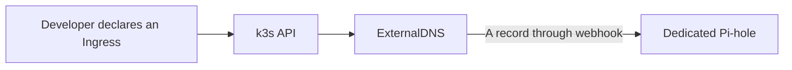
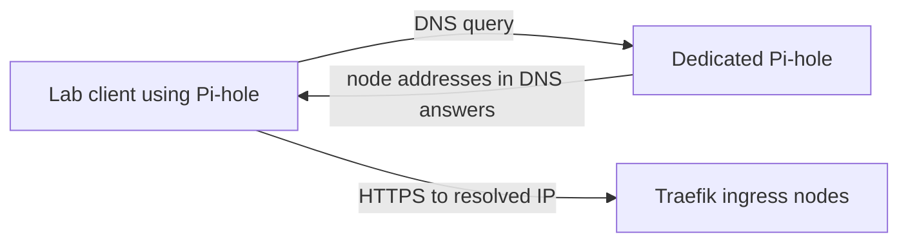

# Dedicated Pi-hole DNS and automatic service discovery

> Scope: provision a dedicated Pi-hole device with Ansible, point the lab
> network at it, and automatically register Kubernetes Ingress hostnames as DNS
> records so every device on the network can discover services as they are
> deployed.
>
> Related: [C4 architecture](c4-architecture.md), [GitOps platform](gitops-platform.md).

## Why

The original design addressed names resolvable only *inside* the cluster
(CoreDNS `coredns-custom`) and on preconfigured workstations. A dedicated
Pi-hole gives one network-wide resolver, and the
in-cluster automation writes an A record for every Ingress host as it appears —
so `redop.atlas.lan`, `git.atlas.lan`, and anything deployed later resolve on
every device that uses Pi-hole.

**Observed 2026-10-07:** Pi-hole `.10` is running on Memex and ExternalDNS has
Ready containers. Direct DNS answered docs with all four ingress node IPs.
This supersedes the old `.107` unprovisioned proposal, but does not establish
DHCP/tailnet adoption or authenticated record-write health. See the
[review's evidence and gaps](infrastructure-review.md#ingress-dns-and-trust).
The following provisioning steps are instructions, not actions performed by
that review.



The registration view has four elements. Resolution and HTTP serving are a
separate three-element path; DNS answers are addresses, not HTTP forwarding.



CoreDNS remains the in-cluster resolution path; Pi-hole provides network-wide
resolution for clients configured to use it. dnsweaver below is an alternative,
not an additional observed controller.

## Part 1 — Provision the dedicated Pi-hole device

### 1.1 Choose the device and address

This project provisions Pi-hole as an unprivileged **LXC container on the
`memex` Proxmox host** (created with the `proxmox_lxc` Ansible role). Give it a
**static address** and reserve it in your router. This runbook assumes:

| Item | Value |
| --- | --- |
| Inventory host | `pihole` |
| Address | `10.0.0.10` |
| Hostname | `pihole.atlas.lan` |
| Host | LXC on Proxmox `memex` |
| OS | Debian 12 |

Add the host to `inventory.yml` (already added — edit the address for your lab):

```yaml
dns:
  vars:
    ansible_user: root
  hosts:
    pihole:
      ansible_host: 10.0.0.10
      hostname: pihole.atlas.lan
```

### 1.2 Create the container and bootstrap access

Create the LXC on `memex` (it is created with the `control` public key already
installed for `root`), then bootstrap the `control` user inside it:

```sh
ansible-playbook ansible/playbooks/proxmox-create-pihole-lxc.yml \
  -e @ansible/vars/memex-pihole-lxc.yml -l memex
ansible-playbook ansible/playbooks/bootstrap-control.yaml -l dns -u root
ansible all -i inventory.yml -l dns -m ping -o
```

See repository runbook `ansible/docs/proxmox-pihole-lxc.md` for the
container spec and the memory-lean profile.

### 1.3 Install and configure Pi-hole

The `pihole` role installs Pi-hole v6 unattended, sets the web password (when
supplied), writes static local records, and verifies resolution.

```sh
# Supply the admin password from a vault/secret, never from the shell history.
ansible-playbook ansible/playbooks/pihole.yaml \
  -e pihole_webpassword="$PIHOLE_ADMIN_PASSWORD"
```

Key defaults (`ansible/playbooks/roles/pihole/defaults/main.yml`):

| Variable | Default | Notes |
| --- | --- | --- |
| `pihole_interface` | `eth0` | interface Pi-hole listens on |
| `pihole_upstream_dns_1/2` | `1.1.1.1`, `8.8.8.8` | forwarders for non-local names |
| `pihole_hostname` | `pihole.atlas.lan` | used by the self-test |
| `pihole_local_records` | `[]` | static records, e.g. router and the Pi-hole itself |
| `pihole_webpassword` | `""` | set via `-e`/vault |

Static record example:

```yaml
# extra-vars
pihole_local_records:
  - { ip: "10.0.0.10", names: ["pihole.atlas.lan", "dns.atlas.lan"] }
  - { ip: "10.0.0.1",   names: ["router.lan", "gw.lan"] }
```

### 1.4 Point the network at Pi-hole

1. **Router / DHCP**: advertise `10.0.0.10` as the primary DNS server (keep a
   public resolver as secondary only for fallback).
2. **Pi-hole upstreams**: keep public resolvers so non-lab names resolve.
3. **Local domain**: Pi-hole answers `atlas.lan` and `lan` from its local
   records; everything else is forwarded upstream.
4. **Cross-subnet clients**: Pi-hole must be told to answer clients that are not
   on its own subnet. The role's `pihole_listening_mode` (default `all`) sets
   Pi-hole v6 `dns.listeningMode`; the old default `local` only answers clients
   on Pi-hole's own subnet, which is why WiFi clients on `10.0.10.0/24` were
   logged as the router (`10.0.0.1`) instead of their real addresses.
5. **Router routing**: for the WiFi scope the router must hand out `10.0.0.10`
   as DNS **and** must route (not NAT/masquerade) between `10.0.10.0/24` and
   `10.0.0.0/24`. If it NATs, Pi-hole still sees `10.0.0.1` and no Pi-hole
   change can recover the client IP.
6. **DHCP**: Pi-hole DHCP cannot serve the WiFi subnet — DHCP broadcasts do not
   cross the router without a relay — so making Pi-hole the DHCP server is not a
   fix here.

Verify from a WiFi client:

```sh
dig @10.0.0.10 example.com
```

Then check the Pi-hole query log: a real `10.0.10.x` address means routing
works; `10.0.0.1` means the router is NATing; a timeout means the listening mode
is still blocking.

### 1.5 Verify

```sh
dig +short @10.0.0.10 pihole.atlas.lan
dig +short @10.0.0.10 dns.google     # forwarded
```

## Part 2 — Automatically register cluster services

Deploy **ExternalDNS** with a Pi-hole webhook provider. It watches Ingress
(and Service) objects and writes A records into the dedicated Pi-hole. This is
the GitOps-managed default and lives in `gitops/apps/external-dns.yaml` with
values in `helm/values/external-dns.yaml`.

### 2.1 How it works

```
Ingress created (host: app.atlas.lan)
        │
        ▼
ExternalDNS reads Ingress + Traefik Service status (node IPs)
        │  ApplyChanges
        ▼
Pi-hole webhook (ghcr.io/tarantini-io/external-dns-pihole-webhook)
        │  Pi-hole v6 API
        ▼
Pi-hole local DNS: app.atlas.lan -> 10.0.0.110..113
```

Records are created/updated on deploy. The tarantini webhook (v1.0.0) supports
only A/AAAA/CNAME and cannot store external-dns TXT ownership records, so the
deployment uses `registry: noop` + `policy: upsert-only`: no TXT records are
written and no records are pruned. `domainFilters: [atlas.lan]` confines it to
the lab domain so it never touches other Pi-hole records.

### 2.2 Deploy it (GitOps)

1. Set the Pi-hole address in `helm/values/external-dns.yaml`
   (`PIHOLE_SERVER`), e.g. `http://pihole.atlas.lan` or `http://10.0.0.10`.
2. Seal a valid Pi-hole **app password** (Pi-hole v6 → Settings → API, or your
   admin password) for initial provisioning or credential rotation. Older
   provisioning notes described a placeholder; the review did not read secret
   contents or verify the current API credential:

   ```sh
   kubectl -n external-dns create secret generic pihole-api \
     --dry-run=client -o yaml \
     --from-literal=password="$PIHOLE_API_PASSWORD" \
   | kubeseal --controller-name sealed-secrets-controller \
       --controller-namespace sealed-secrets --format yaml \
   > gitops/sealed/pihole-api.yaml
   kubectl apply -f gitops/sealed/pihole-api.yaml
   ```

3. Commit/push the platform repo; Argo CD creates the `external-dns`
   Application (it is picked up by the app-of-apps `root`).

### 2.3 Verify

```sh
kubectl -n argocd get application external-dns
kubectl -n external-dns logs deploy/external-dns --tail=50
# a record for an existing Ingress should now answer from Pi-hole:
dig +short @10.0.0.10 redop.atlas.lan
```

### 2.4 Alternative: dnsweaver (homelab-focused, Pi-hole native)

[dnsweaver](https://maxfield-allison.github.io/dnsweaver/) is a single Go binary
that reads Kubernetes Ingress/IngressRoute/HTTPRoute/Service and writes records
to Pi-hole (and can also read Proxmox VMs, so PVE guests get DNS too). Use it
instead of ExternalDNS if you prefer one purpose-built component:

```yaml
# deploy/helm/dnsweaver values (helm install dnsweaver deploy/helm/dnsweaver)
env:
  - name: DNSWEAVER_INSTANCES
    value: pihole
  - name: DNSWEAVER_SOURCES
    value: kubernetes
  - name: DNSWEAVER_PIHOLE_TYPE
    value: pihole
  - name: DNSWEAVER_PIHOLE_URL
    value: "http://pihole.atlas.lan"
  - name: DNSWEAVER_PIHOLE_PASSWORD
    valueFrom: { secretKeyRef: { name: pihole-api, key: password } }
  - name: DNSWEAVER_PIHOLE_RECORD_TYPE
    value: A
  - name: DNSWEAVER_PIHOLE_DOMAINS
    value: "*.atlas.lan"
  - name: DNSWEAVER_PIHOLE_TARGET
    value: "10.0.0.110"     # Traefik node IP (or a VIP)
rbac:
  create: true
```

Do not run both ExternalDNS and dnsweaver against the same domain at the same
time — they will fight over records.

## Part 3 — What still needs to be true

- **Traefik has a stable target.** ExternalDNS points records at the Traefik
  Service status (the four node IPs). If you later add a dedicated ingress VIP,
  set `DNSWEAVER_PIHOLE_TARGET` / add an external-dns `--target`.
- **DNS is not a single point of failure.** Run a second Pi-hole (the Ansible
  role is reusable) and use a shared `custom.list`/config, or use Pi-hole's
  built-in teleporter backup.
- **The webhook is third-party.** Pin its tag (`v1.0.0`) and review it before
  upgrades.
- **CoreDNS stays.** In-cluster clients keep using the `coredns-custom` entry;
  the Pi-hole path is for the wider network.

## Security notes

- The Pi-hole app password is a secret: seal it, never commit plaintext.
- Restrict Pi-hole's admin UI to the lab network; do not expose it publicly.
- `policy: upsert-only` (paired with `registry: noop`) means ExternalDNS never
  prunes records. Deleting an Ingress leaves its A record behind; remove it
  manually or switch to a TXT-capable provider/registry.
- Initial provisioning requires a valid namespace-bound sealed API credential;
  never rely on a placeholder. Current credential validity is not established
  by the review's container-readiness/DNS observations.

## References

- [Pi-hole v6](https://docs.pi-hole.net/)
- [ExternalDNS](https://github.com/kubernetes-sigs/external-dns) and the
  [Pi-hole webhook provider](https://github.com/tarantini-io/external-dns-pihole-webhook)
- [dnsweaver](https://maxfield-allison.github.io/dnsweaver/)
